# Guide Baldur's Gate 3 Race Tier List



Here is my Baldur's Gate 3 Race Tier List! If you've watched my [Youtube video](https://youtu.be/nqgcy5yV6V4) on this subject, this article is the reference sheet for that. Any changes in my opinions will be reflected in this article, which is to say it represents my up to date opinion on race rankings. I hope you enjoy it.

The basic principle for evaluating races is this: look for impactful features that you can’t easily get from other parts of a build. Take Darkvision for example. It is an useful feature, for sure, but its also so easy to get regardless of your race. You can check that box with the Light cantrip, the Darkvision spell, through Radiating Orb, or just through cheap consumables. By contrast Superior Darkvision is a different story! As far as I know, you can get it with the Devils Sight invocation and as a level 3 feature for Gloomstalkers only, so there are many builds that will want Superior Darkvision from their race selection.

Besides that, the other big thing to note is that attribute bonuses have now been standardized between all the race choices. Now all races will get a +2 to one attribute of their choice and a +1 to a different attribute of their choice. This is a big change compared to early access! Now, what makes a race good is their actual racial features, rather then their attribute bonuses.

With those things in mind, lets dive into the tier list!

## Dwarf 

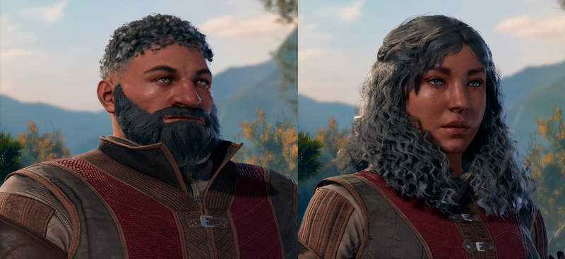

### Gold Dwarf - B Tier

*   Size. Medium
*   Speed. 7.5m
*   Darkvision.
*   Dwarven Resilience. You have advantage on saving throws against being poisoned, and you have resistance against poison damage.
*   Dwarven Combat Training. You have proficiency with the battleaxe, handaxe, light hammer, and warhammer.
*   Dwarven Toughness. Your hit point maximum increases by 1, and it increases by 1 every time you gain a level.

Dwarven Resilience isn’t as impactful as you would expect it to be. In short, there are better, cheaper ways to get damage resistances, so the damage resistance part of the ability isn't as attractive as it used to be. The advantage to the poison condition is useful, but not highly impactful on most runs. Dwarven Toughness, Combat Training, and Darkvision are all useful abilities that are also short of being highly impactful for any build. Altogether, its useful but not highly impactful on every class, which is the very definition of B-Tier for me.

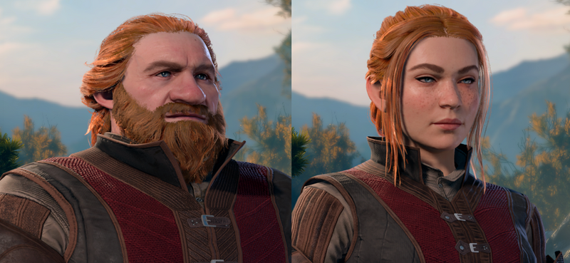

### Shield Dwarf - B Tier

*   Size. Medium
*   Speed. 7.5m
*   Darkvision.
*   Dwarven Resilience. You have advantage on saving throws against being poisoned, and you have resistance against poison damage.
*   Dwarven Combat Training. You have proficiency with the battleaxe, handaxe, light hammer, and warhammer.
*   Dwarven Armor Training. You have proficiency with light and medium armor.

Shield Dwarf trades the +1 hit point per level – a bonus that is equally useful for all classes – for light and medium armor proficiency, a bonus that is better suited for caster classes. This makes Shield Dwarves the caster dwarf option and Gold Dwarf the martial dwarf option. While better for different classes, they both sit solidly in B-Tier for me.

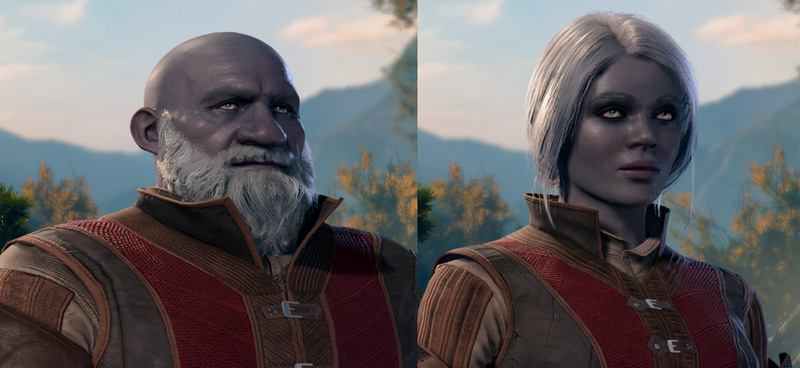

### Duergar - S Tier

*   Size. Medium
*   Speed. 7.5m
*   Darkvision.
*   Dwarven Resilience. You have advantage on saving throws against poison, and you have resistance against poison damage.
*   Dwarven Combat Training. You have proficiency with the battleaxe, handaxe, light hammer, and warhammer.
*   Duergar Resilience.You have advantage on saving throws against illusions as well as against being charmed or paralyzed.
*   Duergar Magic. Starting at 3rd level, as an actio you can cast the Enlarge spell on yourself once per long rest.Starting at 5th level, you can also cast the Invisibility on yourself as an action once per battle. Outside of battle it is an infinite cast spell.

Kind of like a better version of Hill Dwarf in that what it gives is useful for literally every class. Duergar Resilience is amazing because of advantage against Paralyze saving throws, probably the most crippling status effect in the game. Both of its spell are consistently useful, too. The unique, once per battle casts version of invisibility is something I've explored quite a bit and here are some thoughts. Invisibility is a very useful spell for solving out of combat puzzles, like pickpocketing, avoiding difficult encounters, etc. In combat, its a way to drop aggro, get into an advantageous position, and reliably begin combats with surprise. Perfect for Assassin and/or Gloomstalker based builds but useful for practically every run. You just can’t go wrong picking this race.

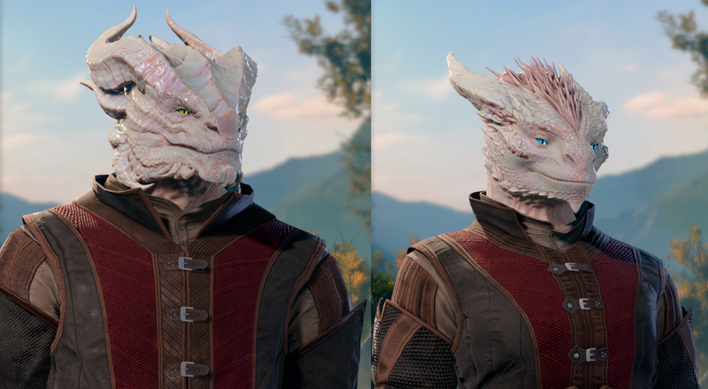

## Dragonborn - C Tier

*   Size. Medium
*   Speed. 9m.
*   Draconic Ancestry. You are distantly related to a particular kind of dragon. Choose a type of dragon from the below list; this determines the damage and area of your breath weapon, and the type of resistance you gain.
*   Black = Acid
*   Blue = Lightning
*   Green = Poison
*   Red = Fire
*   White = Cold
*   Brass = Fire
*   Bronze = Lightning
*   Copper = Acid
*   Gold = Fire
*   Silver = Cold
*   Breath Weapon. When you use your breath weapon, all creatures in the area (probably 5m cone, maybe 1m by 9m line) must make a saving throw, the type of which is determined by your ancestry. The DC of this saving throw is 8 + your Constitution modifier + your proficiency bonus. After using your breath weapon, you cannot use it again until you complete a short rest. The damage increases b 1d6 at level 6 then again at level 11.
*   Damage Resistance. You have resistance to the damage type associated with your ancestry.

The damage on the breath weapon is so low that its practically never worth the action to use it. What we are left with then as far as desirable features go is just a damage resistance, but its so easy to get damage resistances in this game. Still, its something, so not RP Tier, but close.

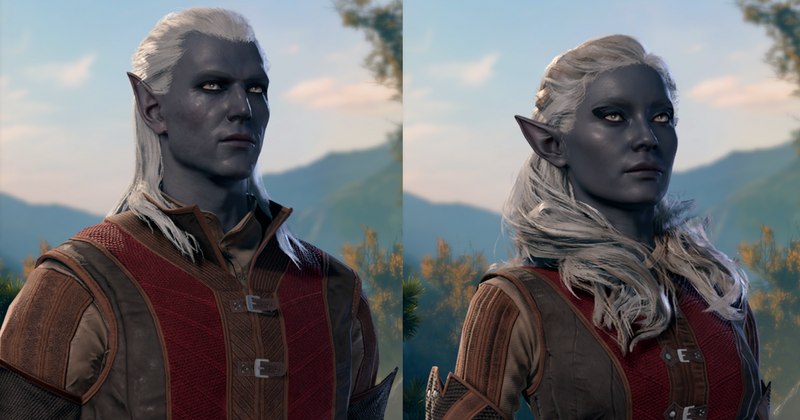

## Drow - A Tier

*   Size. Medium
*   Speed. 9m.
*   Fey Ancestry. You have advantage on saving throws against being charmed, and magic can't put you to sleep.
*   Keen Senses. You have proficiency in the Perception skill.
*   Superior Darkvision.
*   Drow Magic. You know the Dancing Lights cantrip. When you reach 3rd level, you can cast the Faerie Fire spell once with this trait and regain the ability to do so when you finish a long rest. When you reach 5th level, you can cast the Darkness spell once and regain the ability to do so when you finish a long rest. Charisma is your spellcasting ability for these spells.
*   Drow Weapon Training. You have proficiency with rapiers, shortswords, and hand crossbows.

Fey Ancestry is very good on any concentration class, especially early levels, since Sleep is the most reliable way enemies can break your concentration. Superior Darkvision is great for ranged attackers. The spell portfolio isn’t useless, but its not really good either. Keen Senses is just nice to have both in and out of combat. Put it altogether and Drow have a kit that is great for casters and ranged striker builds. Lots of useful things with this race.

## Elf

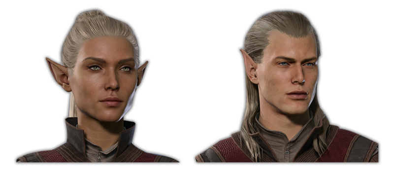

### High Elf - B Tier

*   Size. Medium
*   Speed. 9m
*   Darkvision.
*   Fey Ancestry. You have advantage on saving throws against being charmed, and magic can't put you to sleep.
*   Keen Senses. You have proficiency in the Perception skill.
*   Cantrip. You know one cantrip of your choice from the Wizard spell list. Intelligence is your spellcasting ability for it.
*   Elf Weapon Training. You have proficiency with the longsword, shortsword, shortbow, and longbow.

The unique thing that it gets compared to other elves is the intelligence cantrip which isn’t good enough for us to pick them in most cases. The cantrip is most useful on Eldritch Knight and Arcane Trickster builds, because they are intelligence based classes that don’t already have enough cantrips. Still, having Fey Ancestry and Keen Senses, and Elf Weapon Training is enough to keep them out of C-Tier.

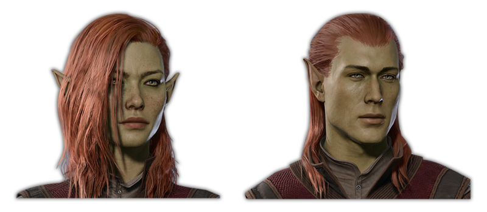

### Wood Elf - A Tier

*   Size. Medium
*   Speed. 10.5m (Fleet of Foot)
*   Darkvision.
*   Fey Ancestry. You have advantage on saving throws against being charmed, and magic can't put you to sleep.
*   Keen Senses. You have proficiency in the Perception skill.
*   Elf Weapon Training. You have proficiency with the longsword, shortsword, shortbow, and longbow.
*   Fleet of Foot. Your base walking speed increases to 10.5m
*   Mask of the Wild. You have proficiency in the Stealth skill.

Just gets a lot of useful features that work for every class, including Fey Ancestry, Keen Senses, darkvision, and bonus movement for either closing distance or kiting. You can’t go wrong with wood elf. Both Stealth and Perception are useful skill proficiencies. Just a lot of minor useful things that add up to a versatile race.

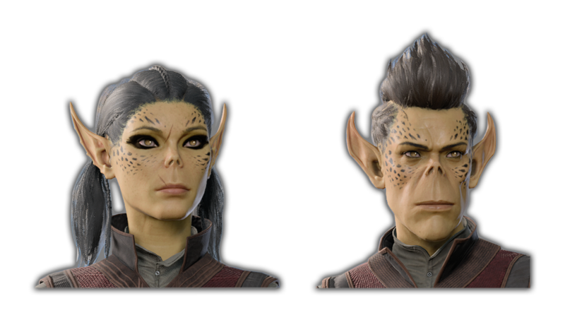

## Githyanki - A Tier

*   Size. Medium
*   Speed. 9m
*   Astral Knowledge: Gain proficiency in all skills corresponding to a chosen ability until your next long rest.
*   Martial Prodigy. You are proficient with light and medium armor and with shortswords, longswords, and greatswords.
*   Githyanki Psionics. You know the Mage Hand cantrip, and the hand is invisible when you cast the cantrip with this trait. When you reach 3rd level, you can cast the Jump spell once with this trait, and you regain the ability to do so when you finish a long rest. When you reach 5th level, you can cast the Misty Step spell once with this trait, and you regain the ability to do so when you finish a long rest. Intelligence is your spellcasting ability for these spells. When you cast them with this trait, they don't require components.

One feature that stands out is its weapon proficiencies, which include Greatswords, allowing you to go for a Great Weapon Master striker build on classes that don’t get martial weapon proficiency. Is that really worth doing? Not so much after level 5 when striker builds start needing more than just GWM but Extra Attack also, and every class that gets Extra Attack also gets martial weapon proficiency. I want to experiment more with it, but at this point I am doubtful there’s a high performing build that uses this strategy.  
  
Besides that, the spell portfolio is one of the best of any race. Medium armor proficiency is clutch for caster classes. Astral Knowledge is very fun and useful and adaptable in multiplayer games. Githyanki also get far and away the most unique items in the game. A very strong race overall!

## Gnome

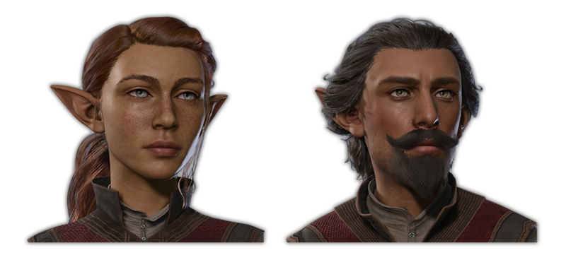

### Forest Gnome - RP Tier

*   Size. Small
*   Speed. 7.5
*   Darkvision.
*   Gnome Cunning. You have advantage on all Intelligence, Wisdom, and Charisma saves against magic.
*   Speak with Animals. Forest Gnomes can cast Speak with Animals once per long rest.

Both Forest Gnome and Rock Gnome get their most valuable feature just for being a Gnome. Their unique subrace features are extremely lackluster.

Gnome Cunning is incredible resilience that is useful for every build. Besides that Forest Gnomes just get darkvision to compensate for a -1 movement. Speak with Animals, so far, is an invaluable role play ability, since it opens up dozens of NPCs to interact with. However, you can talk to all the animals you want just by using Speak with Animal potions. Forest Gnome is the worst Gnome; there isn't really a reason to pick it over the other Gnomes.

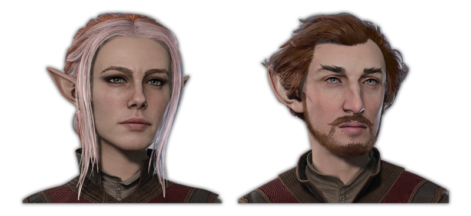

### Rock Gnome - B Tier

*   Size. Small
*   Speed. 7.5m
*   Darkvision.
*   Gnome Cunning. You have advantage on all Intelligence, Wisdom, and Charisma saves against magic.
*   Artificers Lore. Add twice your proficiency bonus to History checks.

The same as Forest Gnome, but trades expertise in history checks for Speak with Animals. History checks don’t offer much in terms of combat utility, either direct or indirect, but as a historian myself, I love the concept as a role play feature. These guys are one of my personal favorites.

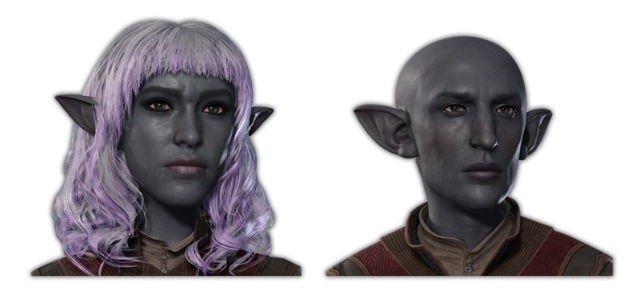

### Deep Gnome - S Tier

*   Size. Small
*   Speed. 7.5m
*   Gnome Cunning. You have advantage on all Intelligence, Wisdom, and Charisma saves against magic.
*   Superior Darkvision
*   Stone Camouflage. You have advantage on stealth checks.

In BG1 and 2, Gnomes were a power gamer’s dream, and my favorite race due to their tricksy, stealthy illusionist playstyle. Deep Gnome translates something like that into 5e, mixing superior darkvision and advantage on stealth checks to the already invaluable Gnome Cunning feature to cook up a surprisingly stacked kit. Stealth is the most valuable skill in the game in my opinion, and the Deep Gnome is the one of two races that get a feature that augments it beyond a simple proficiency. As we’ve discussed above, Superior Darkvision is good on everybody, but particularly good on ranged strikers/casters. This competes with Duergar as the GOAT for sneak and ranged striking builds.

## Half-Elf

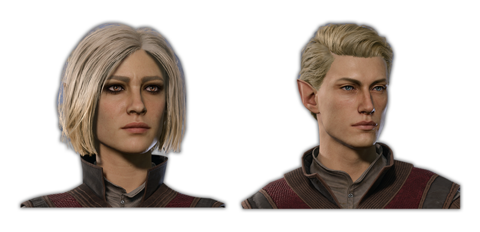

### High Half-Elf - B Tier

*   Size. Medium
*   Speed. 9m
*   Civil Militia: You gain proficiency in all polearms, shields, and light armor
*   Darkvision.
*   Fey Ancestry. You have advantage on saving throws against being charmed, and magic can't put you to sleep.
*   Cantrip. You know one cantrip of your choice from the Wizard spell list. Intelligence is your spellcasting ability for it.

The big change here is civil militia – all Half-Elves get it – so let’s start with that. Shield and Light Armor proficiencies are excellent for caster classes, offering a big AC boost and an early game spike to concentration saves (through Spidersilk Armor + Safeguard Shield). Shields are really strong in BG3, so getting them on casters without needing to multi-class is valuable. The Polearm Proficiencies enable the Polearm Master fear for caster classes that otherwise are locked out from it. Is that worth doing on a caster? I’m not sure! It could be giving a front line caster something reliable to do with their bonus action and reaction. Then again, front line casters want their reaction for the Shield spell. Anyways, its interesting!

On top of that, the Half-Elf chassis gets darkvision and fey ancestry, decent features, but nothing special.

The High Half-Elf offers an intelligence-based wizard cantrip of your choice, which is both niche and negligible. See above in the High Elf entry.

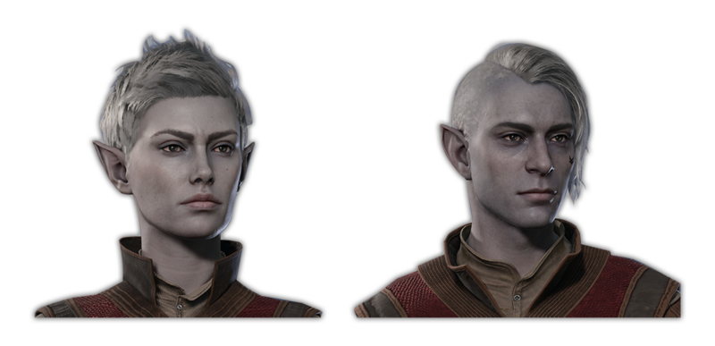

### Drow Half-Elf - B Tier

*   Size. Medium
*   Speed. 9m
*   Civil Militia: You gain proficiency in all polearms, shields, and light armor.
*   Darkvision.
*   Fey Ancestry. You have advantage on saving throws against being charmed, and magic can't put you to sleep.
*   Drow Magic. You know the Dancing Lights cantrip. When you reach 3rd level, you can cast Faerie Fire once, and it recharges after a long rest. When you reach 5th level, you can cast Darkness once, and it recharges after a long rest. Charisma is your spellcasting ability for these spells.

A Half-Elf chassis with added Drow Magic. Drow Magic is decent, but not great. While this race is slightly more versatile than the High Half-Elf, its not enough to bump it up a whole tier.

### Wood Half-Elf - A Tier

*   Size. Medium
*   Speed. 10.5m (Fleet of Foot)
*   Civil Militia: You gain proficiency in all polearms, shields, and light armor.
*   Darkvision.
*   Fey Ancestry. You have advantage on saving throws against being charmed, and magic can't put you to sleep.
*   Fleet of Foot. your base speed is increased to 10.5m
*   Mask of the Wild. You gain proficiency in stealth.

Adds +1 movement and a stealth proficiency to the Half-Elf foundation. As we’ve already discussed, those are useful features on practically every class, making Wood Half-Elf the variant of choice.

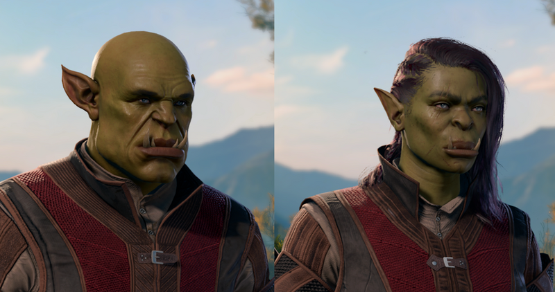

## Half Orc - S Tier

*   Speed. 9m
*   Darkvision.
*   Menacing. You gain proficiency in the Intimidation skill.
*   Relentless Endurance. When you are reduced to 0 hit points but not killed outright, you can drop to 1 hit point instead. You can't use this feature again until you finish a long rest.
*   Savage Attacks. When you score a critical hit with a melee weapon attack, you can roll one of the weapon's damage dice one additional time and add it to the extra damage of the critical hit.

This race gets two very unique and powerful abilities that make it both versatile and the premier class for melee strikers.

To start off with less good stuff, Darkvision is Darkvision, and proficiency in Intimidate is great out of combat utility. The social skills (Persuasion, Deception, and Intimidate) are always high value in terms of out-of-combat solutions to encounters, which can translate into genuine in-combat advantages that are hard to quantify.

Now to the real good stuff! Relentless Endurace is like an automatic, free cast of Healing Word that can proc once per long rest. That is great on anybody but superb on melee characters who are most likely to go down at least once between rests.

Savage Attacks is more damage on crits. Its not a lot of extra damage, but it’s the only race feature that actually directly buffs your damage, probably because damage is just so important, getting it as a racial feature rockets that race to the top of the list.

Altogether Half-Orc is like the best mix of specialized race car with good-ole reliable Toyota sedan. It’s a high-performance pick for any and all strikers, but still offers useful features for everyone else too!

## Halfling

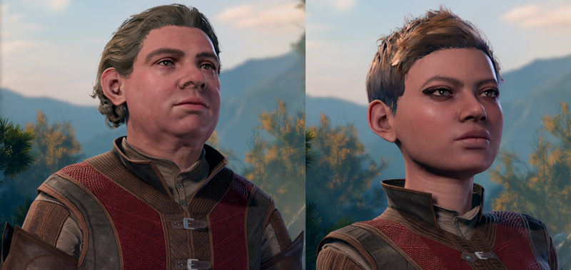

### Lightfoot Halfling - S Tier

*   Size. Small
*   Speed. 7.5m
*   Lucky. When you roll a 1 on an attack roll, ability check, or saving throw, you can reroll the die. You must use the new result, even if it is a 1.
*   Brave. You have advantage on saving throws against being frightened.
*   Naturally Stealthy. You gain advantage in Stealth checks.

We need to start by talking about Lucky. If you average it out across all possible outcomes Lucky translates to something like a +1 bonus, which is small, but even a small bonus that applies to all d20 rolls has a big impact since d20 rolls are the most common and the most impactful rolls in BG3. However, thinking of it just quantitatively misses a lot of what makes it so good. Qualitatively speaking, Lucky is a unique feature for mitigating RNG and offers a peace of mind that you just can’t get from anything else. With Lucky and a consistent source of advantage that pesky “1s always miss”rule dissolves into irrelevance and you can finally depend on ALWAYS hitting that attack or ALWAYs making that concentration save. Its hard to compare a feature like that to anything else. Judging Halflings is extremely hard for that reason and I find myself thinking about the choice between Halfling and other races as one of those genuine expressions of playstyle rather than a solvable, mathematical choice about optimization. I value it extremely highly.

Of the two variations of Halfling though, Lightfoot is the lesser. It gives you advantage on stealth checks (see the entry for Deep Gnome above), which naturally inclines it towards stealth builds, but probably melee stealth builds, since it doesn’t get Superior Darkvision.

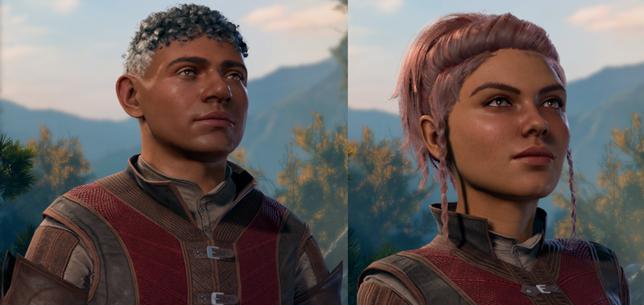

### Strongheart Halfling - S Tier

*   Size. Small
*   Speed. 7.5m
*   Lucky. When you roll a 1 on an attack roll, ability check, or saving throw, you can reroll the die. You must use the new result, even if it is a 1.
*   Brave. You have advantage on saving throws against being frightened.
*   Strongheart Resilience. You have advantage on saving throws against being poisoned and resistance to poison damage.

Strongheart Halflings add Dwarven Resilience (renamed “Strongheart Resilience” but its mechanically the same) to the Halfling chassis. So, now you have a race that gives you advantage to saving throws against two very common status effects, resistance to one of the most common damage types, and Lucky (read Lightfoot Halfling entry above to understand how brilliant this feature is). Halflings are the master race!

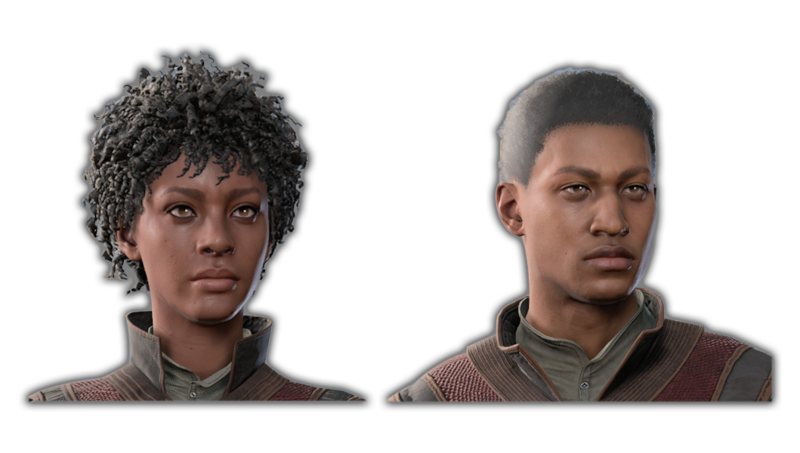

## Human - RP Tier

*   Size. Medium
*   Speed. 9m
*   Civil Militia: You gain proficiency in all polearms, shields, and light armor
*   Human Versatility: You gain proficiency in a skill of your choosing and your carrying capacity is increased by a quarter.

The big selling point here is Civil Militia, see the entry for High Half-Elf above for my discussion of it. 

Human Versatility is kind of a meme, but increased carrying capacity is honestly such a good quality of life buff for me that I kind of like it. Technically, it has no combat utility, and the proficiency is nifty, but very unlikely to outweigh what, say, a High Wood-Elf offers. From an optimization perspective, you should always pick High Half-Elf over human, so RP-Tier.

## Tiefling 

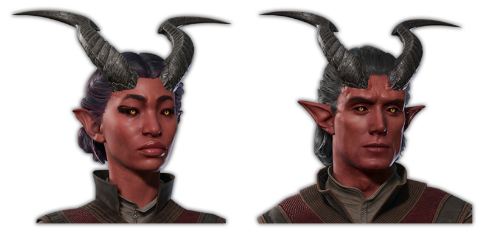

### Asmodeus Tiefling - C Tier

*   Size. Medium.
*   Speed. 9m
*   Darkvision.
*   Resistance to Fire Damage
*   Infernal Legacy. You know the Thaumaturgy cantrip. Once you reach 3rd level, you can cast the Hellish Rebuke spell once as a 2nd-level spell. Once you reach 5th level, you can also cast the Darkness spell once. You must finish a long rest to cast these spells again with this trait. Charisma is your spellcasting ability for these spells.

All Tieflings give you Darkvision, resistance to fire damage, and an portfolio of spells. The spells vary by subrace. For A. Tieflings you get Thaumaturgy, Hellish Rebuke, and Darkness.

Fire damage is a very common damage type, but its also a very common resistance. There are lots of other ways to get it, including the 2nd level Cleric spell Warding Bond, which you want to be casting anyways.

That leaves of with the spells. The A.Tiefling’s selection are all useful, but not unique enough to carve out a genuine niche for it as a choice.

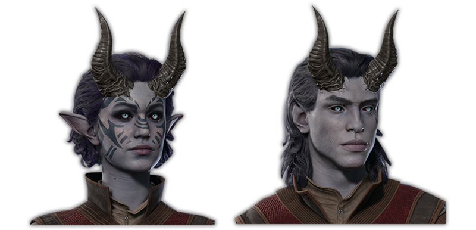

### Mephistopheles Tiefling - C Tier

*   Size. Medium.
*   Speed. 9m
*   Resistance to Fire Damage.
*   Darkvision.
*   Legacy of Cania. You know the Mage Hand cantrip. Once you reach 3rd level, you can cast the Burning Hands spell once as a 2nd-level spell. Once you reach 5th level, you can also cast the Flame Blade spell once as a 3rd-level spell. You must finish a long rest to cast these spells again with this trait. Charisma is your spellcasting ability for these spells.

Mephistopheles Tiefling’s can cast Flame Blade after level 5, and that used to give them a niche. However, changes on full release have really put a dent in the Flame Blade strategy. Its no longer a concentration spell, but it only lasts 10 turns and its summoned to your main hand. More importantly, it no longer procs Circlet of Fire (now called Pyroquickness Hat). Still better than Asmodeus Tiefling.

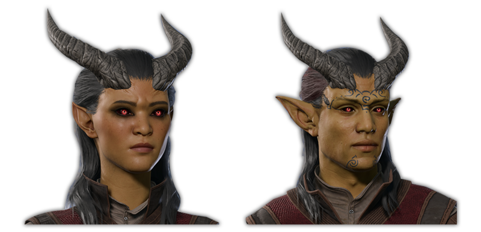

### Zariel Tiefling - C Tier

*   Size. Medium.
*   Speed. 9m.
*   Resistance to Fire Damage.
*   Darkvision.
*   Legacy of Avernus. You know the Thaumaturgy cantrip. Once you reach 3rd level, you can cast the Searing Smite spell once as a 2nd-level spell. Once you reach 5th level, you can also cast the Branding Smite spell once as a 3rd-level spell. You must finish a long rest to cast these spells again with this trait. Charisma is your spellcasting ability for these spells.

Zariel Tiefling’s spells augment your weapon attacks, so its intended to be for weapon based strikers, but for that person it is completely out muscled by Half-Orc. However, Branding Smite can be a encounter deciding spell, making this the best of the Tieflings in my opinion. It right on the edge of C and B Tier to me.

## Summary
-------

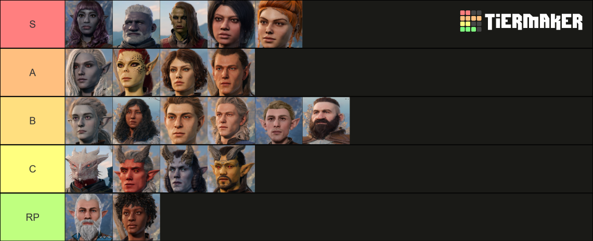

## Video



[Return home](/articles)
