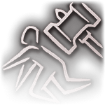
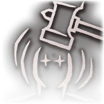
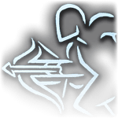
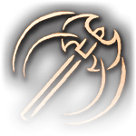
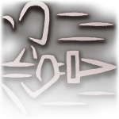
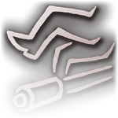
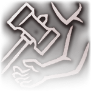

# Guide Baldur's Gate 3 Weapons Tier List

Patch 7 is live! I am releasing this tier list while my game is updating, so all of this information is already outdated. Nevertheless, I want you all to have it for your Patch 7 runs! I will be updating it to include any new weapons that have been added as quickly as I can, so check in again in a few days!

This article is actually two tier lists in one. I rank all the unique weapons in the game, but I also rank Larian's added weapon actions. Both are important to understanding what you will get from your weapon choices.

If you are thinking “I can probably figure out the relative usefulness of these weapons by reading their wiki entries. I don’t need Aestus to tell me which weapons are good.” You are both right and wrong. You are right that you don’t need me to tell you what is good (although I hope you find my opinions interesting at least!). Where you are wrong is that you cannot really know much just by reading wiki descriptions. Many of these weapons do not do what they say they do, including some of your favorites, like the Staff of Arcane Blessing. I painstakingly tested these weapons to find out what they actually do. So even if you understand what makes a weapon good in BG3, you can probably still learn a lot from this article. Even after all my testing, I am sure I missed some things or made some mistakes. If you catch something I missed, let me know and I will update the article.

## Weapon Actions

If you are new to BG3 you may be wondering what weapon actions are. Weapon Actions are simple activatable abilities that you can use once per short rest and are tied to the weapon you use. They were added to BG3 by Larian, so you won’t find them in other 5th edition games.

Because they were added so recently, there is a lot of confusion surrounding these actions. The tooltips do not clear anything up; most weapon actions work very differently than what their tooltip says. I have tested all of them and tried my best to write a clearer description than what is offered in the game. Read them over, some of them may surprise you! I also rank them in a tier system because that’s just what I do!

### Tiers

Here is what the tiers mean:

**S Tier:** Consistently amazing weapon actions. These are game changing actions that are perhaps in need of a nerf. Use these often.

**A Tier:** Consistently good weapon actions. These aren’t game changing but they are useful in most fights and are nice to have.

**B Tier:** Consistently average weapon actions. B-tier weapon actions are underwhelming, but still technically useful in most situations.

**C Tier:** Weapon actions that can be useful in niche circumstances but are usually not worth the resource you expend to use them. These could be removed from the game and no one should really notice.

**RP Tier:** For a weapon action that is actually useless. You don’t get any advantage from using this ability. Larian needs to rework this into something that actually does something.

Many weapon actions require a target to make a saving throw, and thus have a DC. With one exception (Backbreaker) Weapon Action DC = 10 + Proficiency Bonus + Strength/Dexterity Modifier.

Here is a [reference sheet](https://docs.google.com/spreadsheets/d/1NpwOx9Q2agMM_93KIIs0Y52iIzDymI4L9YqdGfpR8Mc/edit?usp=sharing) for which weapons get which actions:

Ok, let’s get to the list!

### Backbreaker - B Tier

The character makes a single standard attack as an action. If the attack hits it deals damage as normal but as if your weapon has 1d4 base damage. Moreover, the target must make a strength saving throw or be knocked prone for two turns. A prone target has disadvantage on strength and dexterity saving throws and all attacks against the target made within 3m have advantage. A target may stand up at the cost of half of its movement.

Note: For some reason Backbreaker has a lower DC than all of the other weapon actions. Instead of 10 + Proficiency Bonus + Strength/Dexterity Modifier it has 8 + Proficiency Bonus + Strength/Dexterity Modifier, a -2 penalty.

With this ability you lose a bit of damage and get a (slim) chance of knocking the target prone (slim because this is a double-hit ability; you have to hit the attack and the saving throw to gain full effect). Prone is an average status condition. The best thing you get from it is advantage on attacks, but on their next turn they will just stand up again, so only use this if you have an ally who can attack before they stand back up.

### Brace - C Tier

You spend 7.5m of movement and for the rest of your turn you roll damage twice and use the highest result.

This ability seems good until you do the math on what rolling damage twice actually does. It adds, on average, 1.65 damage per hit (1.31 for the Longbow). Being able to spend movement (which you often don’t need) to but damage is great, but the damage is just so underwhelming.

### Cleave - B Tier

You attack in a cone that can hit up to 3 targets in front of you. For every attack that hits you deal half of your normal attack damage.

When I released this article I had this ranked C-tier. I've realized now I completely missed the mark with that ranking. The error in my earlier analysis was that I didn't realize it doesn't half flat damage bonuses from sources like Great Weapon Master or Rage. From what I can tell, it halves all damage dice (whether the base damage of the weapon or extra sources like dipped weapons) and it halves your ability modifier (the bonus damage from strength). Everything else is not halved. So it actually does do more damage than a normal hit if you can hit at least two targets.  
  
If you have Great Weapon Master, this is an A-tier action. For everyone else its a B.

### Concussive Smash - S Tier

The character makes a standard attack as an action. If the attack hits the target must make a constitution saving throw or receive the dazed condition for two turns. A dazed creature has disadvantage on wisdom saving throws, cannot take reactions, and loses their dexterity bonus to armor class.

Dazed is an overpowered status condition. Wisdom save spells are the most potent (Tasha’s, Hold Person, etc), so imposing disadvantage on wisdom saves is already enough to make this good. Add on that the target also loses their dexterity bonus to AC and we are in OP territory now. This makes a perfect set-up for Menacing Strike (with an action surge), which is already one of the best control features in the game. Even with all of that, this is still the weakest S-tier weapon action. Keep reading!

### Crippling Strike - B Tier

The character makes a single standard attack as an action. If the attack hits it deals damage as normal but as if your weapon has 1d4 base damage. Moreover, the target must make a constitution saving throw or receive the crippled condition for two turns. A crippled target’s movement is reduced to 0 and they have disadvantage on dexterity saving throws.

A slightly better version of Backbreaker. Not good enough to move it into A-tier.

### Flourish - B Tier

Flourish is like a melee range control spell that takes a bonus action to cast. The target must make a dexterity saving throw or receive the condition off-balance for two turns. A creature that is off-balance has disadvantage on strength saving throws and the next attack against them is made with advantage.

Off-balance is a mediocre condition but being able to apply it on a bonus action is great! Use this to set up a sneak attack or another, stronger weapon action.

### Hamstring Shot - B Tier

Make a standard attack. If the attack hits you deal damage as normal, but the target must also roll a constitution saving throw. If they fail, they acquire the hamstrung condition. A hamstrung target has their movement reduced by 50%.

Reducing movement by half… Who cares? Technically its useful for kiting, buts it’s a single target once per short rest, and kiting is something you need to do more frequently than that. Still, there is no reduced damage on this ability, so there is no drawback to using it. Its just a standard attack with a mediocre added effect.

### Heartstopper - S Tier

The character makes a single standard attack as an action. If the attack hits it deals damage as normal but as if your weapon has 1d4 base damage. Moreover, the target must make a constitution saving throw or receive the chest trauma condition for two turns. A target with chest trauma has disadvantage on constitution saving throws and loses their standard action.

Not enough people are talking about how overpowered Heartstopper is. The enemy loses their action for two turns… TWO TURNS OF NO ACTION. If that doesn’t sound amazing to you, I won’t be able to explain it. Keep a morning-star on every martial character to use this on boss fights or big monsters.

### Lacerate - B Tier

This is made as a part of a standard attack. If the attack hits the target takes damage as normal but also must make a constitution saving throw to acquire the bleeding condition for two rounds. A bleeding creature takes two slashing damage at the beginning of their turn and has disadvantage on constitution saving throws.

This is one of the stronger B-tier abilities. The extra damage is meh. Constitution save disadvantage is real reason to use this. Constitution save spells (Thunderwave, Ray of Enfeeblement, Shatter, Moonbeam, etc) are not as powerful as wisdom save spells, but they can still swing a fight.

### Mobile Shot - RP Tier

When you use your dash action you may make a standard attack as a bonus action.

This is another one that sounds good until you think it over. Its exclusive to hand crossbows, whose niche is being the dual-wield ranged weapon. Dual wielding already allows you make an attack with your bonus action. If you aren’t going to dual wield your hand crossbow then why use a hand crossbow? That is its only advantage over other crossbows. There is absolutely no use for this weapon action.

### Piercing Strike/Shot - A Tier

The character makes a single standard attack as an action. If the attack hits the target must make a constitution saving throw or receive the gaping wounds condition for two turns. A target with gaping wounds takes an additional two piercing damage when hit by an attack. Gaping wounds is removed if the target is healed.

This is my favorite weapon action. Not because it’s the best, but because it’s the most fun to play around with. Gaping wounds deals more damage the more hits you can get against a target. So how many hits can you get in a single turn? Here are the current standings:

1.  Circlet of Fire sorcerer, triple cast of Scorching Ray – 9 hits (18 bonus damage)
2.  Circlet of Fire Thief, dual wielding + Scorching Ray Scroll – 6 hits (12 bonus damage)
3.  Circlet of Fire Warlock, dual wielding + Scorching Ray – 5 hits (10 bonus damage)

The first two are really niche circumstances, but the third is actually practical. I’ve had 5 attack rounds often with a warlock. One of the most reliable ways of dealing high single target damage is with Scorching Ray because it benefits from Mystra’s Blessing, high ground bonus, the easy stealth advantage, and Circlet of Fire. With dual hand crossbows, you can set up on a target with Piercing Shot and Hex, then, next turn, blast them with Scorching Ray and two off-hand shots, each procing the bonus damage from Hex and gaping wounds, for an average of 5.5 bonus damage per hit (the full combo will average 61.5 damage assuming all attacks hit and a 16-17 dexterity).

### Prepare - A Tier

You spend 7.5m of movement to add your strength modifier in slashing damage with your weapon till the end of your turn (i.e. it effectively doubles your strength modifier for damage).

Like Piercing Strike, this ability is fun because of how you can multiply it. You multiply your strength by two, then multiply it again by the number of hits in your turn. On a Great Weapon Master build you can attack at max twice in a turn, meaning every +1 bonus to your strength modifier will do a possible +4 damage with Prepare. Its possible to have a 22 strength (18 base + 4 from potions), which is a +6 modifier, or +24 damage just from strength alone. Of course, only half of that is coming from Prepare, but you get the idea.

### Pommel Strike - S Tier

Pommel Strike makes an attack role as a bonus action. If the attack hits the target takes you strength modifier in damage and must also make a constitution saving throw or become dazed for 2 rounds.

This is like a low damage Concussive Smash, but you can use it on a bonus action. That means you can inflict daze and make a Menacing Strike on the same turn without using action surge. If you do use action surge, you can Menacing Strike twice (if the first one misses). If you are in the same initiative as your wizard, you can Pommel Strike to set up his Tasha’s, and then attack for a free crit. This ability is so good you should never take a short rest before using it.

### Rush Attack - A Tier

As an action you can charge 9m forward in a straight line and attack a target. If the attack hits it deals damage as normal but as if your weapon has 1d4 base damage. On a hit the target must also make a strength save or be knocked off-balance for two rounds. A creature that is off-balance has disadvantage on strength saving throws and the next attack against them is made with advantage.

We discussed off-balance above when we were analyzing Flourish. Its not a great status effect, but its not bad either. The really impactful part of Rush Attack is that you get to move 9m on your action, likely doubling your movement, allowing you to close onto that pesky spell caster on their back lines. This ability does what Mobile Shot was trying to do.

### Tenacity - C Tier

If you miss an attack, you may spend your reaction to deal your strength modifier in damage anyways.

The damage is low and it costs your reaction. At its best its 5 or so extra damage per short rest. Underwhelming, but technically not useless.

### Topple - B Tier

The target makes a dexterity saving throw. If they fail they are knocked prone for two rounds. A prone target has disadvantage on strength and dexterity saving throws and all attacks against the target made within 3m have advantage. A target may stand up at the cost of half of its movement.

Since this is unique to staffs, its functions as an escape for your squishy caster. That is nice to have. It doesn’t require an attack role either, which really helps. This weapon action does its job.

### Weakening Strike - B Tier

The character makes a single standard attack as an action. If the attack hits it deals damage as normal but as if your weapon has 1d4 base damage. Moreover, the target must make a strength saving throw or receive the weak grip condition for two turns. A target with weak grip has disadvantage on attack roles and strength saving throws.

I’m not impressed with weak grip as a condition. Strength saving throws are rare (Entangle, Ensnaring Strike, Backbreaker). Disadvantage on attack roles is good, but not fight changing, and it takes to hits to get that effect. Not useless, but not great either.

## Weapon Actions Final Rankings

**S Tier:**

Concussive Smash, Heartstopper, Pommel Strike

**A Tier:**

Flourish, Piercing Strike/Shot, Prepare, Rush Attack

**B Tier:**

Backbreaker, Crippling Strike, Hamstring Shot, Lacerate, Topple, Weakening Strike

**C Tier:**

Brace, Cleave, Tenacity

**RP Tier:**

Mobile Shot

## List of Conditions

**Bleeding:** A bleeding creature takes two slashing damage at the beginning of their turn and has disadvantage on constitution saving throws.

**Chest Trauma:** A target with chest trauma has disadvantage on constitution saving throws and loses their standard action.

**Crippled:** A crippled target’s movement is reduced to 0 and they have disadvantage on dexterity saving throws.

**Dazed:** A dazed creature has disadvantage on wisdom saving throws, cannot take reactions, and loses their dexterity bonus to armor class.

**Gaping Wounds:** A target with gaping wounds takes an additional two piercing damage when hit by an attack. Gaping wounds is removed if the target is healed.

**Hamstrung**: A hamstrung target has their movement reduced by 50%.

**Off-Balance:** A creature that is off-balance has disadvantage on strength and saving throws and the next attack against them is made with advantage.

**Prone:** A prone target has disadvantage on strength and dexterity saving throws and all attacks against the target made within 3m have advantage. A target may stand up at the cost of half of its movement.

**Weak Grip:** A target with weak grip has disadvantage on attack roles and saving throws.

## Unique Weapons Tier List

Now let’s turn our attention to the unique weapons in the game. As is customary, I’ll begin with some important disclaimers.

By “unique weapons'' I mean weapons (and shields) that have a unique enchantment. The focus of this article is testing and ranking unique mechanics on weapons. There are some non-magical items that have a unique look or name – like the scrap sword or whipping cane – these are not included. Similarly, there are enchanted weapons that are not unique, like a simple +1 dagger, or any generic +1 weapon, these aren’t included. I do not include Phalar Aluve, because even though it has a unique look and name, mechanically it’s just a generic +1 longsword. Conversely, I do include the +1 Light Hammer that you can get at the forge outside the magic tower because even though it has a generic name, it does have a unique, mechanical enchantment.

I’ve left out info on how to get these items to avoid spoilers. If you don’t care about that being spoiled, [this redditer](https://www.reddit.com/r/BaldursGate3/comments/wcp34b/baldurs_gate_3_relevant_items_spreadsheet_updated/?utm_source=share&utm_medium=web2x&context=3) has already compiled a full list of unique items and where to acquire them.  

I will say it again in case you skipped the intro, if you are thinking “I can probably figure out the relative usefulness of these weapons by reading their wiki entries. I don’t need Aestus to tell me which weapons are good.” I will remind you, **many of these weapons do not do what they say they do**, including some of your favorites, like the Staff of Arcane Blessing. I painstakingly tested these weapons to find out what they actually do.Even after all my testing, I am sure I missed some things or made some mistakes. If you catch something I missed, let me know and I will update the article.

### Tiers

**S Tier:** Consistently amazing weapons; sometimes weapons worth building your character/party around, or ones that offer something important to already optimal strategies. Basically, they offer something potent that you can’t duplicate in another way. I try to get these weapons as soon as possible on my runs

**A Tier:** Consistently good or situationally amazing weapons. These are powerful weapons, still good enough to use as your main weapon. Some of them are good as side-arms that you swap into for certain situations. They are great, but not as game-changing as S-tier.

**B Tier:** Just average weapons. As a general rule, B-tier weapons are close in power to a generic +1 weapon of the same type.

**C Tier:** These weapons are underwhelming. Barely better than a non-magical item. You can sell them without a second thought.

**RP Tier:** For those special weapons that just don’t work. Don’t use these weapons for any purpose other than role-playing.

### Absolute's Warboard - B Tier

Weapon Type: Shield

The Word of the Absolute: This is an activatable ability that refreshes on a short rest. All unbranded targets in the area of effect receive the Bane condition for two turns. There is no saving throw to resist and this ability.

Patch 7 nerfed this item into oblivion. Before this patch I was saying it was the strongest item in the game, and now I struggle to get any value out of it at all. I am provisionally ranking it as a B-tier until I can better test the Word of the Absolute, because it isn't functioning the way it used to.

### Adamantine Longsword - B Tier

Weapon Type: Longsword

Versatile Hitter: Hits with this weapon send the target reeling for one turn if it is used with one hand and two turns if it is used with two.

Note: there is no saving throw to resist the reeling condition. A reeling target has a -1 penalty to attack roles.

All of the Adamantine weapons are identical in effect, so I will use the same review for all of them. Reeling is fine. It's just fine. You can count on this weapon, I just prefer my weapons to do damage.

### Adamantine Mace - B Tier

Weapon Type: Mace

Swift Hitter: Hits with this weapon send the target reeling for one turn.

Note: there is no saving throw to resist the reeling condition. A reeling target has a -1 penalty to attack roles.

All of the Adamantine weapons are identical in effect, so I will use the same review for all of them. Reeling is fine. Its just fine. You can count on this weapon, I just prefer my weapons to do damage.

### Adamantine Scimitar - B Tier

Weapon Type: Scimitar

Shift Hitter: Hits with this weapon send the target reeling for one turn.

Note: there is no saving throw to resist the reeling condition. A reeling target has a -1 penalty to attack roles.

All of the Adamantine weapons are identical in effect, so I will use the same review for all of them. Reeling is fine. Its just fine. You can count on this weapon, I just prefer my weapons to do damage.

### Blooded Greataxe - B Tier

Weapon Type: Greataxe

Relentless Revenge: When the wielder has 50% hit points or less, they deal an additional 1d6 slashing damage.

This effect is honestly pretty good, since martials are incentivized by other items to flirt with the 50% HP line anyways. Greataxe’s also get the very fun Prepare weapon action. Its big issue is that heavy, two-handed weapons that do slashing damage are a stacked category, so this axe ends up way down the list.

### Club of Hill Giant Strength - B Tier

Weapon Type: Club

Splinter’s of a Giant’s Might: While wielding this weapon, the user’s strength is set to 15.

Its not good enough to be A-tier, but I use it on a lot of my runs. Its good to give to Wyll, since he only has a +1 modifier in both strength and dexterity. Mostly I just love the convenience of the carry weight boost on a weak party member!

### Corellon's Grace - A Tier

Weapon Type: Staff

Unhampered Resistance: If the user of this staff takes damage while they are not wearing armor (robes are ok), they gain a 1d4 bonus to saving throws for two turns.

Note: The tooltip says “if they get attack while not wearing armor…” but this is incorrect. Right now, as I say above, the effect procs whenever they take damage while not wearing armor. That means it will proc when they get hit by an attack. It also means it will proc if they take damage from something that isn’t an attack, for example, a spell, or a ground effect.

This is for your backline magic user to hold. The effect stacks with Bless, giving you, on average, a +5 to your saving throws. That is obviously amazing, but you have to risk losing your saving throw to get it. I prefer to just hide and not risk getting hit while I am concentrating and use a weapon that gives me a more proactive ability. Nevertheless, I can’t deny that this weapon is good.

### Deep Delver - B Tier

Weapon Type: Warpick

Dig Deep: Inflicts a condition on hit which lasts for three rounds, no save. Hits with the Deep Delver against targets with the condition deal an additional 1d4 piercing damage

This is a very underwhelming item by the time you get it. It gives a little more damage on consecutive hits. Just pass. If you want to use a warpick, go for a generic +1 version.

### Doom Axe - C Tier

Weapon Type: Greataxe

Edge of Terror: Hits inflict a status condition that prevent the target from regaining hit points for two turns. Undead targets also have disadvantage on their attacks for the duration.

It is offering an effect you can already get from a cantrip. Pass.

### Dragon's Grasp - C Tier

Weapon Type: Handaxe

Burned Alive: Deals an additional 1d4 slashing damage to burning targets.

Its low damage and very situational, so not worth more words than this.

### Everburn Blade - A Tier

Weapon Type: Greatsword

Ever-Burning: An arcane flame that cannot be quenched; deals an extra 1d4 fire damage on hit.

It’s a consistent and high damage heavy weapon that you can get early. Unlike others I’ve met on BG3 forums, I don’t consider it the best two-handed weapon in the game, or even the third best. Its still good though.

### Exterminator's Axe - B Tier

Weapon Type: Greataxe

Scourge of Pests: Deals an additional 1d6 fire damage to plants, insects, and small creatures.

A situational version of Blooded Greataxe. Not much to say here, its worth it if you are fighting the creatures its good against, otherwise its just a greataxe. I typically just sell this.

### Faithbreaker - S Tier

Weapon Type: Warhammer

+1 Enchantment

Absolute Power: You make a special attack which deals an additional 1d6 force damage and pushes the target back 5m on a hit. You can use this attack once per short rest.

Note: Unlike the Battlemaster Maneuver Pushing Attack, there is no saving throw to resist the pushing effect on Absolute Power. You can also use this ability to push targets that otherwise couldn’t be pushed with shove, because they are too heavy.

Pushing targets can easily add guaranteed double digit damage in BG3, either from fall damage or from pushing into Cloud of Daggers. Faithbreaker offers the best push in the game. Not only can it push heavy creatures, it does it without a saving throw, all you need to do is hit the attack. This is the best one-handed weapon in the game in my opinion.

### Firestoker - C Tier

Weapon Type: Hand Crossbow

Burned Alive: Deals an additional 1d4 slashing damage to burning targets.

It's the crossbow version of Dragon’s Grasp that you get much later on your runs. Completely underwhelming.

### Giantbreaker - B Tier

Weapon Type: Heavy Crossbow

Heavy Hitter: Hits with this weapon send the target reeling for two turns.

Note: there is no saving throw to resist the reeling condition. A reeling target has a -1 penalty to attack roles.

Reeling is fine. Its just fine. You can count on this weapon. It’s one of the better ranged weapons probably. I just prefer my weapons to do damage.

### Githyanki Crossbow - B Tier

Weapon Type: Heavy Crossbow

Psychic Vengeance: When the user is below 50% health, hits with this weapon deal an extra 1d4 psychic damage.

Some people report that, despite what the tooltip says, some Gith weapons do more damage than others. In all my tests, every Gith weapon functions the same. So I copy and past this review for each.

It’s a small boost to damage that is situational. However, psychic damage is seldom resisted, and dropping below 50% is fairly common, since other items also incentivize it.

### Githyanki Greatsword - B Tier

Weapon Type: Greatsword

Psychic Vengeance: When the user is below 50% health, hits with this weapon deal an extra 1d4 psychic damage.

Some people report that, despite what the tooltip says, some Gith weapons do more damage than others. In all my tests, every Gith weapon functions the same. So I copy and past this review for each.

It’s a small boost to damage that is situational. However, psychic damage is seldom resisted, and dropping below 50% is fairly common, since other items also incentivize it.

### Githyanki Longsword - B Tier

Weapon Type: Longsword

Psychic Vengeance: When the user is below 50% health, hits with this weapon deal an extra 1d4 psychic damage.

Some people report that, despite what the tooltip says, some Gith weapons do more damage than others. In all my tests, every Gith weapon functions the same. So I copy and past this review for each.

It’s a small boost to damage that is situational. However, psychic damage is seldom resisted, and dropping below 50% is fairly common, since other items also incentivize it.

### Githyanki Shortsword - B Tier

Weapon Type: Shortsword

Psychic Vengeance: When the user is below 50% health, hits with this weapon deal an extra 1d4 psychic damage.

Some people report that, despite what the tooltip says, some Gith weapons do more damage than others. In all my tests, every Gith weapon functions the same. So I copy and past this review for each.

It’s a small boost to damage that is situational. However, psychic damage is seldom resisted, and dropping below 50% is fairly common, since other items also incentivize it.

### Glowing Shield - B Tier

Weapon Type: Shield

Loving Protection: Once per short rest, if you are below 50% Hit Points and take damage, you gain 8 temporary hit points.

It’s 8 temporary hit points per short rest, which adds up to 24 per long rest if you maximize it. It is boring, but not insignificant.

### Intransigent Warhammer - A Tier

Weapon Type: Warhammer

Impulse Blast: Knocks nearby enemies prone after killing a target or getting a critical hit

Note: I missed this item on my last run, so I haven’t tested it this patch. I’m going off memory here, but I believe it knocks targets back as well as down.

Knock back effects are often useful. You can force the proc with any auto crit mechanic, meaning you can control when you want to get this effect to some extent.

### Jagged Spear - A Tier

Weapon Type: Spear

Torturer’s Edge: Hits with this weapon impose the tortured status condition. A tortured target has disadvantage on constitution saving throws.

Note: the status condition procs on 100% of hits, there is no saving throw.

This is an enabling weapon, not a DPR weapon. There are some good spells that target constitution (ex: Thunderwave, Ray of Enfeeblement, Shatter, Moonbeam, etc). The fact that there is no save to resist the disadvantage really puts it over into A-tier. Put this on a character who is tanky but isn’t a striker (like Shadowheart, for example).

### Light of Creation - A Tier

Weapon Type: Halberd

+1 Enchantment

Unnamed: Deals an additional 1d6 lightening damage on hit but has a chance to stun the wielder for one turn if they are not a construct.

Note: This weapon stuns the wielder on about 20% of hits. However, what many people seem not to know is that you don’t actually lose a full turn from the stun. It prevents you from taking any more actions on your current turn, but the stun ends on the beginning of your next turn, allowing you to act normally. So, you lose whatever actions you had remaining on the turn you get stunned, and enemies have advantage on melee attacks against you until your next turn.

I love this weapon! It just does so much damage. It’s the highest, unconditional DPR weapon in the game so far, and that isn’t even factoring in that it does lightning damage, which you can double with Create Water. Assuming a base 75% chance to hit and a 16 strength, this weapon will average 13.83 damage per attack against a wet target, or 21.13 with Great Weapon Master!

### Loviatar's Scourge - C Tier

Weapon Type: Mace

Willing Whip: Grants resistance to necrotic damage. Deals an additional 1d6 necrotic damage to nearby targets, including the wielder.

Note: This item is currently bugged, so that it does not deal the additional necrotic damage as the tooltip says.

Because its bugged, this only give you resistance to necrotic damage, which isn’t very common, so C-tier.

### Nature's Snare - B Tier

Weapon Type: Staff

Fly Trap: There is a chance to ensnare the target. Plant and beast creatures are immune.

Note: I’m not sure exactly how often the target is ensnared, but my experience is about 20% of attacks. Notice that I said “attacks” not “hits.” Fly Trap will proc even if your attack misses. When it procs the target is automatically ensnared without a saving throw. On subsequent turns, they will make a strength saving throw to break free. The DC is 10 + Int Mod or 10 + Spell Attribute Mod if you are a caster class (you should be if you use this weapon). The ensnared condition procs damage on the first turn they are ensnared as well as on every subsequent turn before they roll their saving throw (so there are at least 2 guaranteed procs).

Assuming I am right about the 20% proc rate, this feature adds around 1 damage per attack, which isn’t shabby as a feature, but on a quarterstaff its not going to add up to good DPR. You also can’t rely on the entangle procing when you need it.

### Paleoak - B Tier

Weapon Type: Staff

Faithwarden’s Vines: Allows you to cast Entangle as a lvl 1 spell once per long rest.

Faithwarden’t Stride: The wielder of this weapon is immune to all effects of the Entangle spell.

This is situationally good on Druid, basically allowing you to make attacks with advantage. It may deserve A-tier, but I am just not a fan of Entangle. If you like Entangle and use it often, then consider this A-tier.

### Raindancer - A Tier

Weapon Type: Staff

Create Water: May cast Create Water as a lvl 1 spell once per short rest.

Unlike Entangle, Create Water is an S-tier spell, and with this item it refreshes on a short rest! Fantastic way to guarantee Create Water casts on solo Wizard runs. Just a fantastic staff in general. I prefer to get this over Corellon’s Grace in the early game, although I do eventually swap it out for the Staff of Arcane Blessing later. Even after swapping it out, I keep this around as a side arm.

### Ritual Axe - B Tier

Weapon Type: Handaxe

The Scourge Mistress’ Bane: If you deal damage with this weapon, your target receives a 1d4 penalty to attack roles and saving throws for two turns.

Note: This does not stack with the Bane spell. There is no saving throw to resist.

Bane is a potent debuff, as we have discussed. However, there are already several ways to proc Bane, even on hit (Absolute’s Warboard, Gloves of Power). Because of that, I find I that I rarely use Ritual Axe. If you aren’t using any other Bane item, Ritual Axe could be considered A-tier.

### Ritual Dagger - B Tier

Weapon Type: Dagger

Blood Sacrifice: As a bonus action, you can deal 1d4 slashing damage to yourself in order to gain a 1d4 bonus to attack roles and saving throws for one round.

The Pain Maiden’s Blessing: If you deal damage with this weapon you receive a 1d4 bonus to attack roles and saving throws for one round.

Note: the effects do not stack with Bless. However, they also do not require concentration.

Similar to Ritual Axe, there are already better ways of getting Bless than to expend a valuable weapon slot.

### Shattered Flail - A Tier

Weapon Type: Mace

+2 Enchantment

Yeenoghu’s Gift: Dealing damage with this weapon heals the user 1d6 hp and instills them with an insatiable hunger – they can go mad if they do not deal damage each turn.

Note: In all the times I’ve used Shattered Flail I have never had a character go mad.

This is another one of my favorite weapons! It’s the only +2 weapon in the game and it heals on hit as well. If you add up its healing with its damage it averages 5.5 damage swing per hit, which is a lot. For this reason, I like to use it in builds that make lots of attacks.

### Shortsword of First Blood - A Tier

Weapon Type: Shortsword

Break the Unbroken: Deals an additional 1d8 damage if the target is full health.

The value of this really depends on your play style I suppose. It could be either B or A, depending on how you spread out your damage. There isn’t much to explain, it does a lot of damage on first hits. I find that it is good as a main hand weapon for Rogues.

### Sickle of Booal - RP Tier

Weapon Type: Sickle

Booal’s Benediction: Give the wielder advantage when attacking bleeding targets.

Note: Everyone says it gives you advantage when attacking bleeding victims, but haven’t been able to replicate that.

This weapon is bugged right now, making it useless. I expect it would be B-tier,

### Skybreaker - B Tier

Weapon Type: Light Hammer

+1 Enchantment

Searing Smite: Allows you to use the spell Searing Smite (at 1st level) once per long rest.

Searing Smite is a C-tier spell at best, and that’s practically all this item offers. The +1 enchantment is enough to keep it out of C-tier itself though.

### Spellthief - S Tier

Weapon Type: Longbow

Arcane Vehemence: Once per Short Rest, you regain a 1st level Spell Slot when you land a critical hit with the Spellthief.

Note: If you crit with a spell or cantrip while wielding Spellthief you still get a spell slot returned.

Spells are incredible, and this bow gives you an extra one per short rest (three per long rest). Its easy to guarantee crits in BG3 with Sleep, Tasha’s, Hold Person, etc. If you plan carefully, you can swap this item around to all your spellcasters, making sure each of them get the bonus spells. You don’t need to be proficient in Longbows to use it.

### Sorrow - B Tier

Weapon Type: Glaive

+1 Enchantment

Ensnaring Strike: Allows you to use Ensnaring Strike as a level 1 spell once per short rest.

Regret: The user takes 1 psychic damage whenever they deal damage with this weapon.

This weapon needs a buff in my opinion. The look and the way you get it are so cool, but then it just sucks as a weapon. Its not even the 1 psychic damage that ruins it, its Ensnaring Strike. Its just not a good spell… I’m not sure how to fix it, may make it +2? I also wish basic enchantments would effect the DC of weapon action and spells, that might help.

### Staff of Arcane Blessing - S Tier

Weapon Type: Staff

Bless: Allows you to cast Bless as a level 1 spell once per long rest.

Mystra’s Blessing: When you cast Bless while wielding this staff you gain an additional 1d4 bonus to attack roles and saving throws. This bonus increases to an additional 2d4 for spell attacks.

Note: This spell does not do what it says it does. The only effect it gives is a +1d4 (2d4 total) to spell attacks. You do not get any bonuses to normal attack roles and saving throws.

Even though it is only a fraction as good as the tooltip says it should be, its still soooo good. This turns spells like Flame Blade and Scorching Ray into killers. You should be spamming Bless anyways, so any boost to Bless is going to add up to a big bonus just from the frequency of the cast.

### Staff of Crones - RP Tier

Weapon Type: Staff

Ray of Sickness: While wielding this staff, you can cast Ray of Sickness without expending a spell slot. When you do this you simultaneously target yourself with the same spell.

If Ray of Sickness didn’t hit you as well as your enemy this would be A-tier, effectively giving you a boosted cantrip. As it is right now, its just not worth using. Feed it to Gale.

### Sussur Dagger - A Tier

Weapon Type: Dagger

+1 Enchantment

Silence the Enemy: Silences the target for one turn on hit. There is no save, and it procs on every hit.

All of the Sussur weapons are identical in effect, so I will use the same review for all of them. A single target silence that sticks to an enemy is actually better than the AoE Silence spell, because they can’t walk out of a status condition. As I have already said, spell are powerful, so stopping spells from being cast is very valuable.

### Sussur Greatsword - A Tier

Weapon Type: Greatsword

+1 Enchantment

Silence the Enemy: Silences the target on hit. There is no save, and it procs on every hit.

All of the Sussur weapons are identical in effect, so I will use the same review for all of them. A single target silence that sticks to an enemy is actually better than the AoE Silence spell, because they can’t walk out of a status condition. As I have already said, spell are powerful, so stopping spells from being cast is very valuable.

### Sussur Sickle - A Tier

Weapon Type: Sickle

+1 Enchantment

Silence the Enemy: Silences the target on hit. There is no save, and it procs on every hit.

All of the Sussur weapons are identical in effect, so I will use the same review for all of them. A single target silence that sticks to an enemy is actually better than the AoE Silence spell, because they can’t walk out of a status condition. As I have already said, spell are powerful, so stopping spells from being cast is very valuable.

### Sword of Justice - S Tier

Weapon Type: Greatsword

+1 Enchantment

Tyr’s Protection: Allows you to cast Shield of Faith on yourself as a bonus action.

I couldn’t find a png image for this one, so I used a generic greatsword instead. I consider this to be the best two-handed weapon in the game. It allows for an efficient use of you concentration slot, which many two-handed weapon users don’t have. The extra AC also helps proc Ripostes for Battlemasters. All around an awesome weapon that you can get very early in the game.

### Sword of Screams - A Tier

Weapon Type: Rapier

Screams: Deals an additional 1d4 psychic damage on hit.

It's a rapier that will deal an additional 2.5 damage on hit. Like the finesse weapon version of Everburn, only you get it much, much later. Technically it's the highest, one-handed pure damage per hit in the game with no asterisk. I’ve rated it an A-tier, but I think it is still worse than the mainstays of one-handed weapons: Shattered Flail and Faithbreaker.

### The Watcher's Guide - B Tier

Weapon Type: Spear

Death’s Promise: When the spear misses its target, the wielder's next attack against that target is made with advantage.

What’s there to say about this? Its helps you hit more often. There aren’t any tricks for it that I know of. You used to be able to get Death’s Promise on your cantrips by holding The Watcher’s Guide while casting them, but it hasn’t worked for me for a while (it was fixed on Patch 5, my thanks to reddit user Certain\_Childhood849 for bringing this to my attention). It could be used to help proc Sneak Attacks, except that it isn’t a finesse weapon, so it can’t. Its just a mediocre weapon, no tricks.

### Vision of the Absolute - B Tier

Weapon Type: Spear

Absolute Night: There is a chance that you will blind your target for two rounds on hit. Deals an additional 2d6 piercing damage to certain targets that sport multiple eyes.

Note: In my tests, I proc blind on around 40% of hits, not attacks. You need to hit to proc the blind. When it procs, there is no saving throw and lasts for two rounds with no saving throw. It does extra damage to spiders and spectators (my thanks to reddit user TrustKind for the correction on spiders).

This is one of the better B-tiers in my opinion, and you can get it early. Keep it around for fights against spectators or spiders.

### Worgfang - C Tier

Weapon Type: Dagger

Goblin’s Undoing: Goblins had disadvantage on attacks against the wielder of this weapon.

Its decent for clearing the goblin camp, if you prioritize getting it before then. I usually don’t, because I just don’t care about it enough.

### Xyanyde - B Tier

Weapon Type: Mace

Xyanyde’s Fire: Chance to encase its target in a sinister Faerie Fire, granting advantage on Attack Rolls against the target.

Note: Faerie Fire procs on about 20% of attacks. It can proc on misses.

How do you pronounce this name? Is is “Zy-un-ide,” like the word cyanide? That sounds wrong… Maybe “Zy-un-eye-day?” also sounds dumb. I prefer to just change the pronunciation of the second “y’ and pronounce it “Zy-an-ee-day.” Whichever way you prefer, this weapon just isn’t that good. For a debuffing weapon, its better to go with the Jagged Spear.

## Unique Weapons Final Rankings

**S Tier:**

Faithbreaker, Spellthief, Staff of Arcane Blessing, Sword of Justice

**A Tier:**

Corellon’s Grace, Everburn, Intransigent Warhammer, Jagged Spear, Light of Creation, Rain Dancer, Shattered Flail, Short Sword of First Blood, Sussur Weapons, Sword of Screams.

**B Tier:**

Absolute's Warboard, Adamantine Weapons, Blooded Greataxe, Club of Hill Giant Strength, Deep Delver, Exterminator’s Axe, Giantbreaker, Gith Weapons, Glowing Shield, Light Hammer +1, Nature’s Snare, Pale Oak, Ritual Axe, Ritual Dagger, Sorrow, The Watcher’s Guide, Visions of the Absolute, Xyanyde

**C Tier:**

Doom Axe, Dragon’s Grasp, Firestoker, Loviatar’s Scourge, Worgfang,

**RP Tier:**

Sickle of Booal, Staff of Crones

Here is a [helpful spreadsheet](https://docs.google.com/spreadsheets/d/1hEptz8WN_auHCxcLfd0XDAd7cfV0Az7T/edit?usp=sharing&ouid=102922927028635040581&rtpof=true&sd=true) I made for myself that charts relative damage per attack of the weapons you would pick for their damage.

## Conclusion

Thanks for reading!

If you want to discuss this article with me or others, you can do so [here](https://www.reddit.com/r/AestusGuides/comments/std2v6/bg3_weapon_tier_list/?utm_source=share&utm_medium=web2x&context=3)

This article has actually been available for early access for over two weeks on my brand new Patreon! I put a lot of time into these articles, and I have plans to write many more. If you want to enable that please consider supporting me through Patreon. There are several tiers which will give you access to loads of exclusive and early access content! You can find my page [here](https://www.patreon.com/user?u=52365991&fan_landing=true).

[Return home](/articles)
