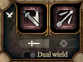
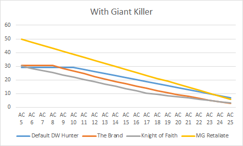

# Guide Miniature Giants– A Meme Build for Playing Minsc in BG3 EA

Are you tired of the same old runs on Patch 6? When you are looking through classes in character creation, does it feel like you’ve played them all; that none of them inspire you anymore? This is a build for you! Like my previous builds, this one centers around a collection of strange mechanical interactions that I think many people haven’t realized are in the game. This set of interactions isn’t as powerful as my others, but I think it is still interesting and fun. I hope you will agree!

## Who is Minsc?

Unlike my other builds, I won’t be attaching a unique character to it for you to draw inspiration from, because the character that inspired this build is Minsc from the original Baldur’s Gate series. Minsc was a well-muscled ranger with a head injury that disrupted his sanity. In mechanical terms this meant he was more min-maxed then most companions, with low mental stats and high physical stats (especially strength). As a character he was like a comic relief version of Don Quixote. Minsc’s head trauma left him seemingly fearless and single-minded in his aim of kicking evil squarely in the pantaloons. It also manifested in a strange break from reality when it came to his pet hamster Boo. In every empirical way Boo was a typical hamster, but Minsc believed – insisted – that Boo was, despite appearances, a miniature [giant space hamster](https://forgottenrealms.fandom.com/wiki/Giant_space_hamster) that possessed cosmic knowledge and who wisely counseled Minsc on matters both tremendous and trivial.

Hailing from [Rashemen](https://forgottenrealms.fandom.com/wiki/Rashemen), it was customary for young warriors like Minsc to journey to distant lands to understand more about the world. Minsc did so as bodyguard for the witch Dynaheir. It was his vow to protect Dynaheir, a vow which he tragically failed. If you want to know more, you should play the games! I will have a build/guide for beginner coming out soon!

In Baldur’s Gate 1, I typically ran Minsc as my single melee attacker in a one-forward-five-back party composition. I equipped him with the greatsword Spider’s Bane and used Dynaheir and others to spam Web spells (to which he was immune) on top of him. He would have a hay day cutting the webbed targets down. The rest of my party would fire arrows and bullets safely from outside.

By Baldur’s Gate 2, Minsc’s build had to change. Dual-wielding was ascendent in this game, and having a high HP progression was no longer enough to effectively absorb damage so I, and I believe many others, would adapt by equipping Minsc with the Flail of Ages. This flail was one of the stronger DPR weapons and also had a powerful slowing effect on hit. Slowing an enemy crippled their damage towards you, giving you some semblance of durability in the late game. If you had access to it, you could also give him a second flail – The Defender of Easthaven – in his offhand. This flail granted damage reduction which you could stack with Armor of Faith in the late game for better durability. So, while Minsc is iconically portrayed as wielding a large sword, I often imagine him as dual-wielding with at least one flail.

## The Build

### *Overview*

Like the Knight of Faith, this build will center around three interlocking synergies. This time its between the Hunter Ranger’s Giant Killer feature, the Beast Tamer Find Familiar ability, and the Enlarge/Reduce Person spell.

First let’s discuss Giant Killer. This is an often-overlooked feature available to the Hunter subclass of ranger. Giant Killer gives you a reaction ability that procs whenever you are attacked by a creature that is large sized or bigger. When it procs, you may spend your reaction to make a retaliation attack against the creature. Now, folks who have been following my work already know how strong reaction attacks are in this game. Optimizing in 5e is partly about finding efficient things to do with the four primary action slots: action, bonus action, reaction, and concentration. Of these four, reaction is the most difficult to consistently utilize. Using it to make an attack – something that typically costs a standard action – is extremely efficient. We’ll see exactly how much it boosts our DPR below, but for now just take my word for it.

Now you may be thinking, “if Giant Killer is so good, why don’t people use it and talk about it more?” People don’t because it isn’t actually a good feature. Its pretty bad. The reason its bad is because, while impactful, it is much too situational to proc. First off, many encounters do not have large or bigger creatures, and in them this feature is dead weight. Second, even if there is a large creature in an encounter, it can be difficult to force that creature to target your ranger. When it procs, Giant Killer is good, but its so situational that it gets completely outcompeted by Colossus Slayer, which is “always on.”

So, if we are going to do a build around Giant Killer, we have two problems to solve:

- Somehow we need to increase the amount of fights that include large enemies.
- We need to find a way to force those large enemies to attack our ranger.

This is where we need to discuss the spell Enlarge/Reduce Person, and you can probably already see where I am going with this!

Enlarge/Reduce Person is a 2nd level spell that has a buff and debuff function. Enlarge Person buffs an ally, making them a size larger, granting them bonus damage on attacks, etc. Reduce Person shrinks an enemy, giving them a penalty to damage on attacks, etc. This is how the spell is intended to be used that is. But have you every wondered, could I enlarge an enemy instead of shrinking them? Yes, you can! Enlarging a medium sized creature makes them into a large one and they now proc our ranger’s Giant Killer ability, increasing the amount of fights that include large enemies! Sadly, even though the enemy gets no debuffs from Enlarge, they still get a constitution saving throw to resist the spell. Landing any save spell is inconsistent, and constitution saving throws can be particularly difficult in my experience, so if we really want this synergy to work well, we should look for a way to make Enlarge Person more accurate.

Pop quiz, what is the most potent constitution saving throw debuff in the game? If you answer “it’s a tie between all the features which inflict a disadvantage on constitution saving throws” you are wrong. You are so wrong that its funny! Seriously, I am laughing at you, we are all laughing at you, that answer is embarrassingly incorrect. The most potent constitution saving throw debuff in the game is Boo the miniature giant space hamster. I’ll explain.

There is another spell called Find Familiar which allows you to summon adorable animal companions so you can RP as a Disney princess. In BG3, rangers can cast this spell at will outside of combat if they choose Beast Tamer as their Natural Explorer option. There are six options for floofy friends we can choose from. One of them is a hamster (Larian mistakenly calls it a rat in the tooltip, that is a type-o that will likely get fixed on full release). A hamster’s fearsome bite inflicts a debuff that gives the target disadvantage on constitution saving throws ***and lowers the target’s constitution attribute by 1 point.*** That means a target with an even constitution will not only have disadvantage on constitution saving throws when they get bit, they will also have a -1 penalty to those saves. This is the most potent saving throw debuff in the game.

Now we can see the full scope of the interlocking synergies. Boo bites a villain, infecting them. That allows our trusty magic user (Dynaheir probably) to reliably Enlarge them. Once they are large, they foolishly attack Minsc who introduces their ass to his righteous boot! Yet again villainy is thwarted by Minsc’s stubborn belief that normal sized creatures are really miniature giants!

Now let’s look out how to build this in more detail:

### *Level 1*

**Race:** Minsc is a Human.

**Attributes:** This one is tough. In the classic games, Minsc’s attributes were:

Str: 18/93  
Dex: 16  
Con: 16  
Int: 8  
Wis: 6  
Cha: 9

Obviously this exact stat distribution is not possible for a human in BG3. The closest we can get is:

Str: 16  
Dex: 16  
Con: 16  
Int: 9  
Wis: 9  
Cha: 9

However, I didn’t do this on my run. I went with:

Str: 16  
Dex: 14  
Con: 16  
Int: 9  
Wis: 12  
Cha: 10

This stat line isn’t as true to Minsc’s character as the one above, but it’s a stronger build. I explained it as Minsc ageing. He’s not a young man anymore, so I think it’s fair to assume he has gotten wiser. To me, the most important thing for playing a character that feels like Minsc is that his strength be as high as possible and that his intelligence be as low as possible. You can choose whichever stat line you prefer.

**Class:** Obviously we are selecting ranger for class. For Favored Enemy, Ranger Knight is closest to Minsc in my opinion (A proficiency in history makes sense for someone so intimately tied to the Bhaalspawn sage). For Natural Explorer select Beast Tamer for Boo.

**Background and Skills:** Folk Hero is the only real option for our background. We’ll get to choose three more Ranger skills. You can choose whatever you like. I think athletics, perception, and stealth fit best.

### *Level 2*

**Fighting Style:** I went with Two-Weapon Fighting, because, like I explained above, I picture Minsc dual-wielding as easily as I picture him with a big sword. If you really want that iconic greatsword wielding Minsc you should pick Defense.

**Spells:** These are completely up to you. Hunter’s Mark is, of course, a good choice. I went with Longstrider so that I wouldn’t have to think about it. It also fits with the reckless berserker combat style Minsc is known for.

### *Level 3*

Here is where we select our subclass. Choose hunter, then pick Giant Killer as your Hunter’s Prey. For your spell, choose whatever you like.

### *Level 4*

The final major choice for this build is what feat we should take. I recommend taking Dual Wielder. Dual Wielder is an infamously mediocre feat choice, so why am I selecting it here? Because I want to dual wield Shattered Flail, and this feat is the only way to do that. Shattered Flail is a good weapon, and is especially potent when used in the off-hand in combination with the Helmet of Grit, so you can proc its on hit effects twice in a round. Also, I like to imagine that it’s Minsc’s iconic Flail of Ages was once again shattered (I know it doesn’t look like that, but its close enough).

Another good feat option for Minsc is getting that 18 strength with an ASI. Minsc Should have at least an 18 strength. It’s a shame that there’s no way to get both the ASI and Dual Wielder yet.

## Notes on Tactics

The Recall that that there are two obstacles for efficiently utilizing Giant Killer:

- Increase the amount of fights that include large enemies.
- Find a way to force those large enemies to attack our ranger.

We addressed the first with Enlarge Person, but we have not addressed the second. Let’s do that now.

Followers of my builds know we have faced this problem before with the Knight of Faith build, and the solution is the same. Run Minsc in a one-forward-three-back composition. That means using Minsc as your only melee attack, keeping the rest back and, preferable, hidden. This will leave Minsc as the only option for your enemies to attack. For this composition you can use any companion whose name isn’t Lae’zel; all of the others can be built into effective ranged attackers.

The obvious difficulty with this is that you are simultaneously forcing the AI to focus fire. I expect most players understand the value of focus fire. Its probably the most basic tactical rule. AI’s seldom focus fire well, but with a one-forward comp they will, and unlike the Knight of Faith, Minsc doesn’t have resistance to physical damage and a refreshable pool of 20+ temporary hit points to make him durable. This is also why I recommend taking dual-wielder to use the Shattered Flail with Helmet of Grit. When you drop below 50% HP (which is often), you will get two attacks with that off-hand flail, healing 7 damage on average if you hit both. That kind of healing helps a lot.

IMPORTANT NOTE: there is an easy to miss toggle option in the user interface that is actually really important for this build. Its in the lowest part of the attacking section that looks like this:

See the toggle which says “Dual wield?” That is the important one. Make sure it is set to dual wield, not “One handed.” It should be set to dual by default, but accidentally hitting its hotkey – “R” – can switch it without you noticing. When it is set to dual you will retaliate with both weapons, main hand and off-hand, with Giant Killer instead of just your off-hand. Just setting this toggle correctly will double the potency of your Giant Killer procs.

## Performance

In the title I called this a meme build. It’s meant to be funny and interesting, not powerful. Nevertheless, let’s see how it matches up in DPR to our previous builds!

First, here is how it compares if we don’t factor in Giant Killer:

Terrible, right? But procing Giant Killer actually doubles our DPR for that round. So here is how that would look:

The problem is, unlike the Knight of Faith, procing the retaliation damage is difficult and comes at a high action economy price. So, its really not as good as this graph makes it seem.

Overall, I would rate this build a “C.” Its just too situational. It is an S-tier for fun though!

## Conclusion and Announcement

If you want to discuss this build with me or others you can comment [here.](https://www.reddit.com/r/AestusGuides/comments/s45w9d/miniature_giants_a_meme_build_for_playing_minsc/?utm_source=share&utm_medium=web2x&context=3)

If you liked it you might like my other builds! You can find them [here](https://www.aestusguides.com/guides/vlaakith-s-arcane-knight-of-faith-a-great-weapon-master-wizard-build) and [here.](https://www.aestusguides.com/guides/the-brand-of-cloakwood-coast-a-druid-striker-build-for-baldur-s-gate-3)

I want to sign off of this one with an announcement. If you enjoy my articles and have a minute to spare, I would appreciate your attention. I have had a blast writing all of these tier lists and guides! There is a ton more I want to write, however, the time it takes me to make these is not sustainable or healthy for me as a volunteer service, so I am forced to find a way to monetize this or drastically cut back on my output. I hope you understand. In the next month or so I will be exploring ways to make this project sustainable. I am looking into Patreon, a Youtube channel, and, maybe, putting ads on the website. I would really like Patreon to be an alternative to putting ugly ads on the site. Of course, I will be offering exclusive content to my patrons, but what exactly that will be I am still exploring.

If you are interested in the Patreon please let me know! Also, if you want to learn about/weigh in on what exclusive content might be offered you can do that [here](https://www.reddit.com/r/AestusGuides/comments/r8zhim/announcement_and_new_article_myths_on_polished/). If you just want to talk to me directly, please feel free to DM me on reddit, you can find my personal subreddit [here](https://www.reddit.com/r/AestusGuides/). If you aren’t a reddit person, you can contact me through my business e-mail: aestusguides@gmail.com

Thank you for your time!

[Return home](/articles)
