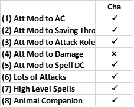
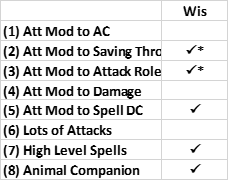
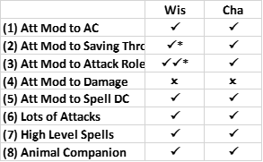

# Guide RPG Veteran, Pathfinder Beginner: Journal #1

Hello Pathfinder community! I am a CRPG and tabletop RPG veteran with 20 years of experience in D&amp;D and D&amp;D CRPG’s, particularly the Baldur’s Gate Series. If you play BG3 you may know me from the popular tier lists I have on this website. I think us CRPG enthusiasts are building an awesome community around a unique artform, and I want to contribute to it! Towards that end, I have been trying to push myself to broaden as well as deepen my engagement with CRPGs, and the beginning of that for me is to leave the familiar comforts of D&amp;D games into the daunting Pathfinder system, starting with Wrath of the Righteous. I am having a blast! I thought it would be interesting if I journaled my thoughts about Wrath of the Righteous *while* I am learning it. If you are new to the game like me, you might find this series helpful. If you are an experienced player it may be funny to see me stumble my way through!

However, while I am new to Wrath of the Righteous, I am not new to CRPGs. I try hard to push my analysis of all CRPGs as deep as I can, and I find that I tend approach optimization in games in a unique way that will at least be interesting, even if it is mistaken. I predict that even the readers who have mastered the Pathfinder system will learn something from this series, even if its just a new way to think about the game. That’s my goal!

I should also note that I am not a true beginner in Pathfinder. I have hundreds of hours in the Neverwinter Nights series and tabletop 3 and 3.5 editions which are, I’m sure you know, precursors to the Pathfinder system. Also, as of the time of writing this, I have 40ish hours in both Wrath of the Righteous and Kingmaker. Most of those hours have been reading tool tips, testing mechanics, and restarting Act 1. I have not played a character past level 5 in either game. I think that qualifies me as a beginner, but I have put enough time into it to (hopefully) have something interesting to say.

In this journal entry I want to discuss the kind of build that I will be exploring.

## What I Am Focusing On in these Journals

Part of what makes CRPGs so interesting and unique as an artform is how they harmonize so many different crafts. In this series I will be focusing primarily on only one of those crafts, and I want to let you guys know that at the outset. Just like the RPG experience, I see three pillars of CRPG design:

- **Tactical System Design**: this usually includes a three-dimensional tactical combat system and adjacent mechanics for building/progressing your units in that system
- **Story Craft**: this is the narrative overlay overtop of the tactical combat game. It has all the same elements of storytelling in literature but usually with an emphasis on co-operation between the creator and the consumer. That is, the creators write a story with variable outcomes, and we, the consumers, select which of those variables to actualize in our runs. Importantly, the variables we select are assumed to be *expressive of our character.*This makes CRPGs unique because the consumer is expected to be part actor and part author. They author a character then act out that character, both in dialogue and, interestingly, through the tactical system. Successful CRPG story craft must create an interesting setting and plot for us to put those characters in. It also has to allow for many different characters to be made. And, finally, it has to reward each of those possible characters with a satisfying story arc.
- **Game Craft**: this is what I call the important aesthetic design elements of CRPGs. It’s the art direction, but its also user interface/experience. It is the are I know the least about.

Of course, all of these pillars will mix together and play off of each other. My interests in general are on 1 and 2. For this series I will be focusing almost entirely on 1, because that is just how I get into new games. Lets get to it!

## Attribute Builds

At the beginning my analysis of the Wrath of the Righteous has been focused on learning the basics; reading class, spell, feat descriptions and the like. That is all boring and not fun to read about. But through all of that I have managed to pick out an avenue of builds that I want to begin exploring, and those are what I call “wisdom builds,” a subset of attribute builds in general. An attribute build is a simple and effective strategy for high performance builds that has existed since the 3rd edition days. It has two steps: (1) you stack one attribute as high as you can and (2) you combine as many class features as you can which scale with that attribute.

Now, I try not to research to much what other content creators are doing just because I don’t want it to influence my own way of thinking. However, with a game as complex as Wrath of the Righteous its hard to avoid looking at other people’s work just as a learning shortcut. So, while I don’t know much about the state of optimization in Wrath of the Righteous, Youtube did recommend to me a few builds for the Oracle, that, from what I gather, use the attribute build philosophy. I want to sketch an Oracle build like this and use it as a foil to explain the builds that I want to explore.

The Oracle build that I have in mind is all about charisma. You know the type: Scaled Fist 1/ Paladin 2/ Oracle 17, or Eldritch Scion 3/ Paladin 2/ Oracle 15. With the later build you can apply your charisma modifier to:

- AC (Nature’s Whisper)
- Saving Throws (Divine Grace)
- Spell DC (Oracle Spellcasting)
- Attack roles (Magus Arcana: Arcane Accuracy)

All of this while benefiting from 14 levels of a full caster (with merged spell book I believe. I haven’t gotten that far yet), 16 BAB at level 20, and an animal companion to boot. Charisma is now a super stat, and you can stack heaps of it for insane scaling.

Notice this is the same pattern of build for some simple martial builds. For example, a strength build might put 20 levels in Two-handed Specialist to apply strength to:

1. Atk roles
2. Dmg x2

Which gives very one dimensional but delightfully multiplicative scaling.

A dexterity attribute build can apply a dex mod to:

1. AC
2. Attack roles (Weapon Finesse)
3. Damage (Finesse Training or Fencing Grace)
4. Attacks of Opportunity per round (Combat Reflexes)
5. Reflex Saves

Hopefully you see the pattern: these are what I call attribute builds.

Once we notice this pattern, we can create a shopping list of things to look for in an attribute build:

(1) Attribute Modifier (Att Mod) to AC conversion

(2) Att Mod to saving throw conversion

(3) Att Mod to attack roles

(4) Att mod to damage roles

(5) Att mod to spell DC

And then we can add to this some secondary scaling factors which connect to these, i.e.:

(6) A high number of attacks per round (APR)

(7) A high level of spell slots

Finally, we should add:

(8) An animal companion (the higher level the better)

Just because every build is improved by an animal companion from what I can tell.

These 8 items are not exhaustive. There are other areas we can stack an attribute score to, for example:

(m1) Att Mod to skill checks

(m2) Att Mod to initiative

(m3) Att Mod to CMD or CMB

While these are useful, they are not as important as 1-8, so I may mention them when I outline builds, but as something like a footnote.

## Wisdom vs. Charisma

It seems to me as a beginner that wisdom builds are the strongest and most versatile of the attribute builds in Wrath of the Righteous, so I have decided I will begin my exploration of the system by exploring optimization of wisdom builds. To outline my reasoning for thinking this I will compare a possible wisdom build to the oracle build outlined above. I am assuming that the charisma stacking oracle build with a few dips is considered a strong build. It seems strong to me, but I am new to this game.

Before getting into the builds, I want to point out an asymmetry between wisdom and charisma when taken in abstraction from class specific mechanics. Setting aside class bonuses, your wisdom modifier improves your will save and three skills (perception, nature, and religion). Charisma only modifies two skills (persuasion and use magic device). There is a background (acolyte) that allows us to use our wisdom instead of charisma for persuasion checks, so a wisdom build can dump cha at the cost of losing effectiveness in one skill, whereas if a charisma build dumps wisdom they sacrifice effectiveness in 3 skills and their will save, meaning wisdom has an advantage in this regard. Now let’s look at the builds.

We noted above that a Paladin 2/ Eldritch Scion 3/ Oracle 15 build checks off many of the items on our shopping list. In fact, of the eight items it satisfies seven of them. Those seven are:

Concerning (6), this builds just squeaks by the 16 BAB, which unlocks the 4th attack. They also have access to Oracle spells like Divine Power which boost APR. Concerning 8, with 14 levels in Oracle your animal companion will not max out in levels. I believe it will be level 19 on the completed build, which is one level under max, still good.

Now let’s look at the Wisdom build to see how it compares. The core class tree for Wisdom stacking is the Cleric of Erastil, community and nature domains. Nature domain grants an animal companion. At level 8 the community domain grants a once per day ability (Guarded Hearth) that adds your wisdom modifier to saving throws and attack roles to yourself and allies in the AoE. Of course, Clerics are full casters and add wisdom to their spell DC as well. This class alone checks the following items off:

I gave (2) and (3) asterisks to note that it is only once per day but also buffs, potentially, the entire party. I leave it to you whether that is a positive or a negative. I think it is positive.

From the Cleric base class there are two directions we can build depending on whether we want to use ranged or melee weapons. For ranged you could dip into Zen Archer and for melee Instinctual Barbarian. I will explore both eventually, but for now let’s focus on the Zen Archer build, because that is the one I am currently playing through the game with.

A three-level dip into Zen Archer will check off (1) through the Monk AC feature, and (3) through the Zen Archery feature. As an aside, it will also get us some very valuable feats. That leaves our wisdom build – Zen Archer 3/ Cleric 17 – with the following:

Side by side with the charisma build our wisdom build checks off the same 7 items that the charisma build does, only they can add their wisdom modifiers to attack roles *twice.*Moreover, when we examine and compare each item we will see the wisdom build gets a little more value out of most of these checks. 

For AC, the charisma build *substitutes* charisma for dexterity when determining your dodge bonus. The wisdom build does something different; it adds your wisdom modifier to your dexterity modifier *so long as you are not wearing armor*. There are several subtle differences between these. For one, the charisma build could theoretically dump dexterity now that they do not need it for AC. Is that a good idea? I’m not sure. Dexterity is still useful for reflex saves, initiative roles, and extra attacks of opportunity from combat reflexes, so I am wary of dumping it. In the wisdom build you are forced out of wearing armor. I am not sure if that is a big issue, because I don’t know what loot is in the game. If there are equally good robes as there are armors, then I would say the wisdom build is getting a better feature.

For saving throws the charisma build is getting an “always on” feature whereas the wisdom build gets theirs once per day. We already discussed above how, while being once per day, the wisdom character can add their modifier to their allies as well, which is huge. Notice also that wisdom already applies to one save – will – so the wisdom build is still getting 1/3 of the boost to saves as an always on feature. Then when they use Guarded Hearth they are technically adding their wisdom modifier to their will save twice! I think the wisdom build wins out here.

On attack roles the situation is reversed, where it’s the wisdom build that gets this as an always on feature. The charisma build will be able to add their modifier to attack roles for a number of turns equal to 1 + their charisma mod, which should be a lot, but likely won’t cover every turn of attacks. I can’t be certain on this until I’ve had more experience in the game (if you know please tell me on reddit, I have a link below). Either way, the wisdom build is just superior here.

Concerning spell DC, my understanding is that Oracles and Clerics have similar, if not the same, spell lists. Our wisdom build is getting two more levels in their caster class, but I think with merged spell books this will be a wash, so no advantages on either side here. The same goes for (7). I believe on all matter related to spells these builds will function the same.

How about number of attacks? Here also the wisdom build is superior. The charisma build gets one more attack through BAB and potentially another if you select the Wolf-Scarred Face curse. The wisdom build makes up for this through Flurry of Blows from our Monk levels. Note, the extra attack from Flurry of Blows is made at highest BAB, and if that’s not enough for you, we can add another full BAB attack on top of that by expending a Ki point (we get 1 + wisdom mod per day).

The only area where the charisma build wins out that I can see is with their animal companion, which will be level 19 compared to the wisdom build’s level 17 animal companion. I expect two levels is a fairly significant difference. Fair play there to charisma.

Altogether, by focusing on wisdom as your primary attribute you can multiply it in more ways and in more potent ways then if you focused on charisma. Assuming that an oracle charisma build is a potent one (it seems like it is to me), then this wisdom build should be even better.

## Conclusion

Making this comparison is what got me interested in wisdom-based attribute builds, so I am planning on spending the next few weeks exploring them. Right now, I am level 5 – Zen Archer 3/ Cleric 2 – playing on core difficulty. Once I have completed this play through I’ll write up another journal entry to outline the build in detail. After that I want to explore an Instinctual Barbarian build, then some of the other wisdom-based classes (Druid, Inquisitor, and War priest). Hopefully once I have mastered the wisdom classes, I’ll be able to construct a better wisdom attribute build, which I will use it as a reference point for future builds.

I expect I will look back on this entry and smirk once I’ve learned more. You may be smirking right now! If you are a Pathfinder veteran and want to tell me how wrong I am you can comment on this article [here.](https://www.reddit.com/r/AestusGuides/comments/rd00t1/rpg_veteran_pathfinder_beginner_journal_1/)

Thanks for reading! Till next time!

[Return home](/articles)
