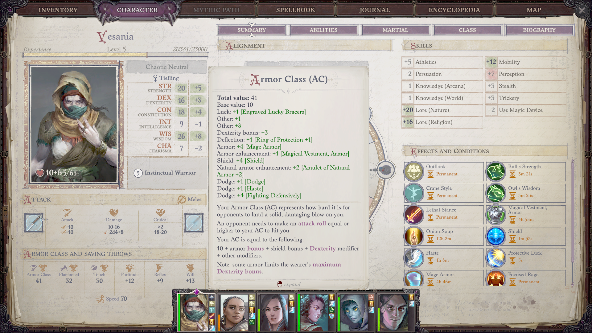

# Guide RPG Veteran, Pathfinder Beginner: Journal #3

Hello again! Damn… Pathfinder is a complex system. Hands down the hardest to learn in the CRPG cannon. We are lucky to have these games! In a lot of ways they are slog, but I’m honestly loving the challenge!

If this is your first time reading one of my articles, I am a CRPG and tabletop RPG veteran with 20 years of experience in D&amp;D and D&amp;D CRPG’s, particularly the Baldur’s Gate series, who is trying to learn the Pathfinder system by playing Wrath of the Righteous. I am journaling my progress because its useful for me and, I hope, interesting to read. If you are new to the game like me, you might find this series helpful. If you are an experienced player it may be funny to see me stumble my way through!

In my first entry I outlined the specific kinds of build that I am interested in exploring: wisdom attribute builds. Basically, these are builds that focus on getting the most out of the wisdom attribute, then stack it as high as possible! I argue that wisdom stacking builds are actually stronger, or at least as strong, as the ever-popular charisma stack builds (Scaled Fist/Paladin/Oracle angel path, you know the ones…). You can [read it here](https://www.aestusguides.com/guides/rpg-veteran-pathfinder-beginner-journal-1). I’ve put another 50 hours of play and probably another 50 in analysis since I wrote the first entry, but I honestly think it holds up!

In my second entry I explored sources of what I call “overwhelming damage.” Basically, overwhelming damage is the term I coined for when you are doing so much damage its practically redundant to add more. As an extreme example, if you are doing 10,000 damage per round, what use it to add 1,000 more? You are better off building for other things at that point because your DPR is already secured. I listed five possible routes for achieving overwhelming damage. You can [read it here.](https://www.aestusguides.com/guides/rpg-veteran-pathfinder-beginner-journal-2)

In this article I have three topics I want to discuss:

- The Instinctual Warrior class as a wisdom stack build.
- The best weapon in the game (in my opinion).
- My first steps in Unfair difficulty.

It’s a lot, so it may be a bit longer than my previous entries.

## The Instinctual Warrior

After Christmas I tabled my Zen Archer/Cleric build which I outlined in the first entry. Not because I think it doesn’t work – I’m still convinced it’s a top tier build – but just because I botched some stuff in the crusade mode part of the game, and it was making it a real grind. I also was excited to try out the Instinctual Warrior build anyways, so I went for it. Here’s what I’ve learned.

Someone in the thread for my first article linked me [this list of builds](https://www.neoseeker.com/pathfinder-wrath-of-the-righteous/builds/Main_Character#Instinctual_Trickster_.28Barbarian.29). I browsed it and noticed that they ranked the Instinctual Warrior class as the best class overall and had a main character build for it. I was intrigued, but then a little disappointed when they didn’t go into much detail on what made it so good or why they made the choices they made in the build. I’ve been testing it, and the run isn’t done, but I think I’ve learned enough to shed some light on how the class functions, particularly in the early-mid game.

Let’s start with damage. Its very simple to find damage for a barbarian due to their Rage Powers. The Lethal Stance line offers some accuracy and the very valuable increase to our critical multiplier, perfect for the Trickster Crit route for overwhelming damage that I mentioned in Journal #2. Instinctual Barbarians also get the valuable Blind Fighting line of feats for free, further increasing their accuracy. On top of that, you can and should go with the Beast Totem line of Rage Powers as well, which is a prerequisite for the Charge route for overwhelming damage. So, any Barbarian with Trickster path will have their damage secured by around Mythic Level 5 or so (depending on how quickly you want to rush it). Before then we’ll need to rely on a nifty weapon I’ll discuss below.

But the Instinctual Warrior isn’t the only class that can easily achieve overwhelming damage. What makes it stand out so much that some people consider it the best class in the game? Well, if you’ve secured overwhelming damage on any build you then need to invest in other things, things like durability and initiative and that is where the Instinctual Warrior excels.

Instinctual Warriors get the same AC progression as Monks: they get to add their Wisdom modifier to their dodge bonus and they get a +1 to their dodge bonus every four levels (starting at +1 at level 4 and going up to +5 at level 20). Anytime you add two attribute modifiers to your dodge bonus you can get ahead of the curve early, because you have two stats that you can buff instead of one (Instinctual Warriors get a free buff to their Wisdom when they rage). That is, you can cast both Owl’s Wisdom and Cat’s Grace, giving you +4 to your AC instead of the typical +2. Also because spread your stats out more in character creation (it costs more to invest in one stat) or just pick a race that gets bonuses to your two AC attributes. Then you get the further ahead of the curve with the extra 4 AC per four levels, a whole new boost not available to most classes.

Then there is the durability offered through the typical Barbarian class features. Through the Beast Totem line, which we need anyways, you get a further +1 AC (this time natural armor bonus) every four Barbarian levels (up to +6 at level 20). Normal Barbs take a -2 penalty to AC when they Rage, but Instinctual Warriors don’t. When you rage you also get temporary hit points equal to two times your hit die. All of these things add up.

You should of course invest in Dodge and Crane Style early as well for even more dodge AC.

As a proof of concept, I was able to get a 41 AC on my Instinctual Barbarian by level 5

I chose level 5 just to demonstrate that it’s AC gets ahead of the curve early. You can further grow in into the late game by taking Archmage Armor Mythic ability, through the natural progression of the class, and stronger buffs.

Now, I actually think the build that I linked above can be improved on, with… you guessed it, stacking wisdom! Their build recommends investing primarily in strength. I’m not sure why. Strength offers more damage, which we don’t need on this build. I recommend starting with 16 strength and 19 wisdom and investing everything in wisdom (24 wisdom base by the end). Why? Well wisdom is our best defensive stat, and like I mentioned, we have enough damage in this build, so its better to invest in defense. Moreover, Instinctual Warriors also add their wisdom to their initiative roles, which is extremely valuable and easy to overlook.

If that hasn’t sold you, consider this: through the Trickster path we get access to two Cleric domains. I recommend you pick Community and Madness. With these domains we get two potent auras that scale off our Wisdom. So investing in wisdom will gets us:

- \+ 3 AC
- \+ 3 Initiative
- \+ 3 Will save
- \+ 3 to attack roles and saving throws (through Guarded Hearth)
- \+ 3 to the DC on the confusion effect (from Aura of Madness)

By contrast, if you follow the other guide and invest in strength you will get a +3 to attack and +4.5 damage roles. Its not a good trade.

In conclusion, the Instinctual Warrior may be the best pound-for-pound melee martial class in the game, and its even better if you stack wisdom on it. Is it the best class in the game like folks say? I don’t think so. I don’t think any class that doesn’t have spells or a pet can be considered the best in the game. However, its definitely an S-tier class. If you’re keeping score, wisdom attribute builds now have one of the best all-around builds (my Zen Archer/Cleric) and one of the best martial builds (Instinctual Warrior).

## The Best Weapon in the Game

Now let’s talk about the best weapon in the game. It’s the falchion Jinx, which you can buy at the very start of Act II. I haven’t heard anyone talking about how OP this item is; there should be way more hype. Here is what it’s in game description says:

“Whenever this +2 Cold Iron falchion lands a hit on a creature that is under a Hex effect, it deals addition weapon damage.”

Perhaps because I am still unfamiliar with Pathfinder’s language, it wasn’t clear to me what this meant. “How much additional weapon damage?” I thought. Is it like a +2 damage? Then it occurred to me that “weapon damage” must be a technical term in the rules for the damage dice attached to the type of weapon you use, in the case of a falchion, 2d4. That would be an average of +5 bonus damage on hit, 7 total when you include the +2 enchantment. That’s decent damage for an early game weapon, and I use Hexes a lot anyways, so I bought it.

Then I started hitting hexed targets with it, and it was doing waaaay more than +7 damage. It was doing double. Like, a hit with Jinx against a hexed target was worth two hits against a non-hexed one. I started to look at the math a little closer and I discovered that it is functioning almost identically to the feat Manyshot. Here is its description:

“When making a full attack with a bow, your first attack fires two arrows. If the attack hits, both arrows hit. Apply precision-based damage (such as sneak attack) and critical hit damage only once for this attack. Damage bonuses from using a composite bow with a high Strength bonus apply to each arrow, as do other damage bonuses, such as a ranger's favored enemy bonus. Damage reduction and resistances apply separately to each arrow.”

Using Jinx against a hexed target is like Manyshot, *but on every single attack*, not just the first. Depending on where your damage is coming from, that is close to doubling your damage, and this is an effect from weapon you can buy at level 6. Talk about getting ahead of the curve. This also doubles the damage from Vital Strikes, adding a x2 multiplier to a damage route that already abuses multipliers.

If you’re thinking “A +2 weapon isn’t going to compete with +5 weapons in the late game” don’t forget about the Greater Magic Weapon spell. For the cost of a level 3 spell slot Jinx stays relevant the entire game.

In my Instinctual Warrior run Jinx keeps my damage decent while almost completely investing in defense. However, once I discovered how strong Jinx was, I really wanted to test how hard the damage spikes if you build around it for Vital Strike, and that brings me to the last section of this entry.

## First Steps on Unfair Difficulty

So far the reaction to these articles has been mostly good, but of course there are some people who are mad that I would dare share my analysis of the game without having completed a run. The thing is, I know that when I complete a run they’re still going to write me off until I complete a run on unfair difficulty. That’s fine, I like doing runs on the highest difficulties, so I have already put 10-15 hours testing a few builds in the Shield Maze. I’ve learned that you can clear the Shield Maze on unfair with practically any build once you know a few tricks, though some builds really struggle against the Water Elemental. Here are some of the tricks.

*Level 1:* This is the section of tunnels leading to Neathholm. The trick here is make sure you initiate every fight with Anevia so that she procs aggro. This does two things. First, Anevia is an important character, so the game won’t let her die permanently. Second, with good initiative roles you can position in between her and the enemy before they charge, procing attacks of opportunity. Anevia trails behind your group, so the only way to have her initiate the fight is to turn your backs to enemy right before you get to them. Anevia, trying to follow behind, will walk toward the enemy and initiate the fight. With this trick and halfway decent luck you can get to Neathholm without any reloads.

*The Shield Maze:* Of course, the real challenge is the Shield Maze. This is going to require some patience no matter what you do, but here are the most important things you can do to make it as painless as possible.

First, and most importantly, side with Wenduag over Lann. I cannot stress this enough. If you pick Lann get ready to reload the Hosilla fight a hundred times. When you have Wenduag in your party she will execute Hosilla after you drop her to 40% health or so, when she summons the quasits. This is so important because normally Hosilla will reset aggro after the cut scene, which is disastrous, because there isn’t a way to consistently clear this fight without procing her aggro on your tank. If she kills a target she frightens your team, and there isn’t a reliable way to recover from that.

Second, when you level to two, make sure you take the Protective Luck Hex for Camellia and make Wenduag (or Lann, if you want to go hard mode) a Hunter. Hunter’s get a pet; pick leopard. Now you’ve got your tank. Leopards can get a 30+ AC with Mage Armor, Shield of Faith, and Fighting Defensively. Make sure to draw aggro with the leopard, have Camellia spam Protective Luck on it, and you can get through most fights without taking any damage. My thanks to the youtuber [cRPG Bro](https://www.youtube.com/c/cRPGBro) for bringing this to my attention.

The last trick is having your strongest melee character read the tome in library (the second room you can encounter) and use a masterwork glaive. Spam charge in fights. You still won’t hit the difficult enemies reliably, but this is the best way to deal damage.

Other than that, make sure you are using the potions and scrolls you pick up. Buy every useful consumable from the shop at Neathholm. Mage Armor and Shield of Faith are essential. You can find a potion of Barkskin in the summoning room, right before Hosilla. If you decide to take on the Water Elemental, its best to use it there. You can find some nifty loot in the optional room with the monitor lizards too.

For your main character, I find that arcane casters are the most valuable, because they bring more casts of Mage Armor, Grease, and allow you to use some of the valuable arcane scrolls that you can find/buy. Getting a scroll of Blur but not being able to cast it is painful. However, as I said above, with these tricks you can get through the Shield Maze with practically any character. I’ve done it with three separate builds now.

If you enjoyed this article, I hope you will consider checking out some of the others I have on my website. I want to make top tier educational and analytical CRPG content centered around BG3 and Wrath of the Righteous in particular, and I would really like to do it full time. If you want to support me, [I just launched a Patreon](https://www.patreon.com/user?u=52365991&fan_landing=true) where I offer exclusive content to subscribers. If you’re interested but aren’t sure about me and/or whether you will get your money’s worth out of a Patreon sub, you can also talk to me directly and I’ll convince you. Contact me [through reddit](https://www.reddit.com/r/AestusGuides/) or my email: aestusguides@gmail.com

If you want to discuss this article with me or others, you can do so [here.](https://www.reddit.com/r/AestusGuides/comments/skpenu/rpg_veteran_pathfinder_beginner_journal_3/?utm_source=share&utm_medium=web2x&context=3)

[Return home](/articles)
