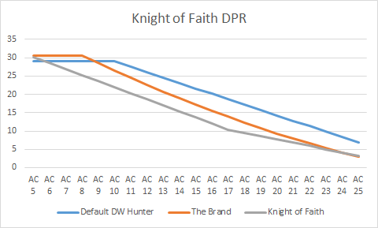

# Guide Vlaakith’s Arcane Knight of Faith – A Great Weapon Master Wizard Build

*“Infinite resignation is the last stage before faith. The moment the Knight executes the act of resignation she is convinced of the impossibility. The Knight of Faith realizes this just as clearly: she can be saved only by the absurd. Consequently, she acknowledges the impossibility of her desire, and in the very same moment she believes the absurd and knows, through the paradox, she will find fullfillment.”*

This is a build that uses innate Githyanki weapon proficiencies to get the Great Weapon Master Feat on an abjuration wizard, combining the Sword of Justice Shield of Faith with Arcane Ward and a synergy of defensive spells to create an unstoppable juggernaut. This build can put a target to sleep, crit them for 30+ damage its turn, and still do 20+ damage on enemy turns at nearly zero opportunity cost, all the while being the tankiest member of your party. If this seems impossible to you, keep reading!

## The Build

#### *Overview*

Soren Kierkegaard understood faith as the act of giving up what you desire and, paradoxically, believing you will receive it in the very act of giving it up. He called the person who does this the Knight of Faith (“knight” here is referencing a literary trope of his time, where a knight represented someone of ultimate devotion) I call this build a Knight of Faith because they give up a crucial attribute for their class – intelligence – and paradoxically believes they will receive it back (which they will!). This is my way of justifying an int-dump wizard and shoehorning Kierkegaard into a BG3 build.

This build has three interlocking mechanical synergies. The first is Githyanki racial proficiencies with the Wizard class. A typical Wizard cannot wear armor or get proficiency in a heavy weapon without investing a feat. However, a Githyanki wizard can, because Githyanki have innate proficiencies in medium armor and greatswords, among other things. The medium armor is nice, but the greatsword proficiency is the only way in early access that you can take the Great Weapon Master (GWM) feat on a wizard. If you don’t know what GWM does, the short version is it does super high damage at the cost of accuracy. Wizard spells like Sleep, Tasha’s, and Hold Person guarantee crits though, so the accuracy loss can easily be mitigated and what you are left with is just insane damage with almost no drawbacks.

That’s just the first synergy! The second is combining the Sword of Justice item with the abjuration wizard subclass ability: Arcane Ward. Arcane Ward gives you a pool of temporary hit points, called a ward, when you first cast an abjuration spell. You can then “heal” the ward with subsequent casts of abjuration spells. The problem with this feature is that there aren’t very many flexible abjuration spells in the game currently, so it is not often that casting an abjuration spell feels worth the spell slot. The Sword of Justice fixes this issue by allowing you to cast the abjuration spell Shield of Faith as bonus action without expending any spell slots. Shield of Faith is also a strong defensive buff. With Githyanki Half Plate armor, Shield of Faith, and all three Mirror Images you will have 28 AC and 11 temp HP. Remember, this is on a class with GWM and 18 strength if you eat the hag’s hair.

There is still one more synergy left to discuss, and it’s probably the most broken of them all, but you may not get it on every run. It’s the synergy between Arcane Ward and Armor of Agathys if you can acquire a scroll for it. Right now the game allows you to stack the temp HP from Arcane Ward and Armor of Agathys, and it counts it all as one pool of health that triggers the retaliation damage. That means a single upcast of Armor of Agathys will give you 21 temp HP and do 10 retaliation damage for as long as you have it. You can cast Armor of Agathys before combat starts (it lasts until your next long rest), so all that health and damage is coming at almost no opportunity cost as far as actions go. You can absolutely combine this with Create Water – your retaliation damage doubles against targets with the wet condition. It’s also worth casting Blade Ward in these situations. Casting Blade Ward every other turn will turn that 21 temp HP into 41 against slashing, bludgeoning, and piercing damage.

I honestly cannot think of a stronger solo build. Its only problem is that there are too many super-efficient actions to take in a turn!

#### ***Level 1***

**Race:** this build works best if you go Githyanki, because that grants us both a medium armor proficiency and the greatsword proficiency that we need to eventually use the Sword of Justice to proc our Arcane Ward feature and get the GWM feat. However, there is at least one other good racial option in Shield Dwarf.

Shield Dwarf amounts to a tankier but less offensive option compared to Githyanki. You won’t be able to go GWM, so your auto-attack DPR will be significantly lower. However, you can still get good DPR out of this build if manage to find a Flame Sword scroll. Then you will become like a wizard version of [the Brand](https://www.aestusguides.com/guides/the-brand-of-cloakwood-coast-a-druid-striker-build-for-baldur-s-gate-3). If you like this idea better, be sure to take something like option B for attributes (I will outline that below) so you can use the Circlet of Fire. I don’t prefer this build because of the anti-synergy between Create Water à Armor of Agathys and Flame Blade as your source of damage. The wet condition from Create Water will half your Flame Blade damage. For that reason I will be assuming we chose Githyanki for the rest of the guide.

**Attributes:** there are two ways that we can allocate our attribute points depending on whether you want to commit to using the Headband of Intellect or not. They are:

Option A

Str: 17  
Dex:14  
Con: 15  
Int: 9  
Wis: 10  
Cha: 8

Or,

Option B

Str: 17  
Dex:13  
Con: 12  
Int: 16  
Wis: 8  
Cha: 8

The tradeoff is slightly better physical stats for option A at the cost of your helmet slot. Is that a good trade? To be honest, no. There are really good helmets in BG3, like the Circlet of Fire (see [this build](https://www.aestusguides.com/guides/the-brand-of-cloakwood-coast-a-druid-striker-build-for-baldur-s-gate-3) for an example of how powerful it can be), the Helmet of Grit, or even just a standard, non-magical helmet (which gives immunity to critical hits). In my opinion, from a strictly power perspective it is better to go with option B. However, I like option A for my character concept, so I will use option A.

As a note, in both options I am assuming you will use both hag’s hairs to boost your odd number attributes. For option A it is strength and constitution; for option B it is strength and dexterity.

**Class:**Wizard!

**Spells and Cantrips:** a big part of the fun of playing a Wizard is creative spell selection/use that changes from run to run due to the variability of scroll drops. I don’t want to spoil that fun by demanding you take a specific spell list, and I also cannot predict which scrolls you will get on your run. Instead, I will just list the spells that I mentioned in the build overview above as crucial to the build and leave the rest up to your imagination. If you want to know my opinions on the strength of spells, I have written a review of every spell available in early access so far, which you can find [here](https://www.aestusguides.com/guides/baldurs-gate-3-spell-tier-list). The crucial spells for this build are:

- Blade Ward
- Armor of Agathys (scroll)
- Create Water (scroll)
- Sleep
- Tasha’s Hideous Laughter.

At character creation you can pick up Blade Ward, Sleep, and Tasha’s. I will also recommend that you pick Light as one of your cantrips, because Githyanki do not have darkvision. DO NOT PICK FIREBOLT OR MAGE HAND. Firebolt is available as a guaranteed drop on the nautiloid (in the Us room, on the corpse of one of the imps, when your Tav says “Devilkin? Am I in the hells?”). Mage Hand you will get for free just for being a githyanki.

**Background and Skills:** skill selection isn’t that important in terms of optimization, so here is our chance to go hog wild on roleplay. Our highest attributes are strength and intelligence, so it’s a generally good idea to focus on those skills. Strength only has one skill – athletics – which you can pick as your racial bonus skill. That leaves us a few options for background. You could go Sage, then put your two class skills into two other intelligence skills for a total of four. For role play reasons I want my Tav to be an Acolyte, so I picked that background and then arcana and investigation as my class skills.

If you want to solo with this build, pick the urchin background.

***Level 2***

No big choices here except that you need to pick the Abjuration School as your subclass. We need this subclass to synergize its Arcane Ward feature with Armor of Agathys and the Sword of Justice.

***Level 3***

Now we get access to 2nd level spells. I will say again that these choices are up to you. There aren’t any second level spells that we need to make this build work. I highly recommend picking Cloud of Daggers, however. It’s a new spell, so there aren’t any scrolls of it in the game, and it’s the best consistent use of the concentration slot this build has access to.

At this level you should be strong enough to take on the ogres in the Blighted Village and the paladin party on the Risen Road. These fights will get you the Headband of Intellect and the Sword of Justice respectively.

***Level 4***

The big choice here is our feat, and, of course, we will select GWM. If you prefer to focus your character on being a controller rather than a striker then take the ASI to bump your intelligence to 18 assuming you went option B. If you went option A, but still don’t want GWM, then you can take the ASI to bump strength to 20.

In this level you are definitely strong enough to take on the Hag to snag those two hairs we discussed above under character creation attributes.

## Notes on Tactics

This section can either be to long or to short. If I discussed all the ways we can use our spells tactically it would be to long, but I have already discussed most of that in my [Spell Tier List](https://www.aestusguides.com/guides/baldurs-gate-3-spell-tier-list) article, so please give that a browse if it interests you.

Without analyzing the spells in depth, I am left with some very short general advice: think very carefully about what role you play and how to synergize with your party composition while playing this build. It is a build that wants to do a lot of things: absorb hits, attack, and enable through control spells and it can be really easy to forget which of these is the right action in a certain turn or party composition. As cool as it is to crit for insane damage, or deal 20 cold damage as retaliation, you still need to have a wizard casting control spells on your team. It is just too valuable a class and role to pass on.

So here are the guidelines that helped me. If you want to enable this build to be a striker/tank be sure to also have Gale in your party. Use Gale to cast the valuable control spells and focus on striking with Tav. If this is your strategy, consider running a “one-forward-three-back” formation with Tav being the one forward. This will force the most melee aggro possible onto your Tav for that sweet retaliation damage. Gale, Shadowheart, and Wyll/Astarion, all built for ranged damage is my recommendation.

If you are the kind of person who hates bringing two of the same class in your party, then the best way to run this Tav is as a controller first and striker second. It helps me to think of them as like Gale but more durable and with more efficient auto attacks for after you’ve locked down the fight. When I play Gale I find that he will typically have one or two fight changing rounds where he lands his spells, and for the rest of a combat he’s just spamming inefficient Firebolts. This Tav should play the same way, but instead of inefficient Firebolts he’s packing a massive frig'n greatsword.

## Performance

Let’s begin by analyzing how this build performs in DPR. Here is how it compares to other builds we’ve discussed:

If you were confused about why we should play as a controller first and a striker second, this is why. Just getting GWM is not enough for making a high performing striker. What makes GWM so strong is enabling it through control spells like Sleep, Tasha’s, and Hold Person, or adding attacks on your reaction with Battle Master Riposte and Menacing Strike. In this build, we enable ourselves, which is good, but it means less rounds attacking.

Keep in mind also that while we don’t have consistent ways of weaponizing our reaction, we do have a way to deal retaliation damage through our frosty armor. If we assume that we can proc a 20 damage retaliation once every two turns (which is a modest assumption I think) here is how our DPR would look:

Now we are talking! This still isn’t the full picture though. If you are refreshing your armor in a fight, that is a turn where you are not attacking. Retaliation damage can look great as raw numbers, but you cannot control to whom that damage is applied. It can definitely be more valuable to do less damage to the right target then just doing tons of damage wholesale.

Overall, I would rate this build an “S” for effectiveness, but its very dependent on using it right. Its an S primarily because it’s a wizard and wizards are just phenomenal. It’s probably the best wizard build I know of. However, if you don’t play into a wizard’s strengths, which is controlling the battlefield, it won’t perform at an S level.

## The Character – So’kier

A Page from So’kier’s Journal. It is written in flawless Githyanki script.

*“Ancient prophecies foretell that when things look bleakest for the Githyanki people, Gith will return to save her people from despair.”*

*Am I Gith returned?*

*Our people are temporal beings who have found the eternal. I will say it again, we are finite beings who have found the infinite. Know that what IS found is what WAS sought. Do you see the tension in our existence? It is the tension of tense; the seeking to no longer seek. To seek is eo ipso to be within the temporal. I will tell you of my seeking because it may become a record of cosmic importance, but I will not waste words like one of the mawkish races. A Gith at least has the courage to transcribe her thoughts plainly, without cloying adornment. Vanity is valuable so long as it does not steal time from the seeking.*

*I will start at the eternal. To seek one must believe; in what is sought and in one’s strength to find it. Within the infinite, belief is paradigmatically, though not essentially, immediate, that is, via an un-mediated encounter of the senses. But in seeking the belief is essentially mediated because its object is something that is not yet acquired. If it was immediate it would already be acquired and there would be no seeking. A belief is mediated through a communication. To believe mediated through communication is called trust, and unlike in unmediated belief, to trust is a choice. One who begins to seek through trust leaps from the temporal toward the eternal, for in seeking their life integrates teleologically – toward what is sought – and insofar as this end exceeds other desires, and this is the kind of end of which I speak, they become a single integrated thing. But note, the eternal is NOT an infinite sequence, but is the infinite, thus this is a leaping toward the eternal, not the eternal fully realized. When one receives the communication, when one chooses to leap in trust toward the eternal, let us call that The Moment.*

*Now we start at the beginning. In the shamed creche K’ren I was hatched and raised. I was strong, swift, and stupid. Then came The Moment. In my sleep I saw a vision of myself as Gith reborn. In this vision I wielded a Silver Sword and lethal magic against the ghaik. My thoughts moved beyond my mind and struck with the force of a titan. Crowning my brow was a bronze band with a sapphire gem. I was the hate and vengeance of my people and our enemies, helpless, they begged, but were slaughtered for the glory of our queen. When I awoke from this dream a portentous symbol appeared on my forehead where the sapphire had been. That was The Moment. The rest is the leap. From The Moment onwards I accepted no training that was not in magic or the teachings of Vlaakith and Gith. I learned neither well, but I gleaned the principle of them both: to hate. This I mastered.*

*Gith was the hate and vengeance against the ghaik. We are the githyanki. I am Gith returned.*

So’kier refused to be trained as a soldier and instead floundered in arcane instruction. For this she was mercilessly beaten and ridiculed by her instructors. However, they dared not execute her because of the mark on her brow. On the eve of her graduation, she had another dream, which led her to travel north to the sword coast. It was here that she was abducted by the nautiloid.

#### *Roleplay Notes for So’kier*

I really wanted to lean into the alien aspects of So’kier, which is why I chose to write a backstory primarily in her own voice. I think she has several really interesting role-playing opportunities.

First, So’kier is a religious/nationalistic fanatic. I try to begin her run with an unquestioning, naive adherence to githyanki dogma, but that evolves into a sophisticated, curious faith after she gets the Headband of Intellect. You can choose to portray this (or not) however you like, but some interesting opportunities are her relationships with Lae’zel and Shadowheart and her approach to her mindflayer psionic powers. An evolved So’kier will find the tadpole powers fascinating rather than revolting like Lae’zel does. Aren’t the innate psionic gifts Githyanki have the result of their centuries of captivity? How are the tadpole powers materially different? Gith used psionic magic of the ghaik to fight the ghaik and free her people. So’kier, similarly, will be tempted to embrace the tadpole powers to use against the mind flayers. Afterall, in her vision she wielded potent psionic magic, perhaps these new gifts are the fulfillment of that prophecy. For So’kier anything which fulfills her vision is justified.

That brings us to the second role-play opportunity, which is that So’kier earnestly believes she is Gith reborn. For those who don’t know, Gith was the warrior queen who united her enslaved people in revolt against their Illithid captors. The term “Githyanki” means “the followers of Gith.” Gith disappeared on a diplomatic mission to the Nine Hells, a mission which still secured a pact with Tiamat. Since her disappearance the githyanki have been ruled by the Vlaakith dynasty. Prophocies fortell her return. Perhaps So’kier is their fulfillment, or perhaps she is just another deluded fanatic. I leave that to you to decide!

The third and final roleplay opportunity lurks behind the previous two, and it is the central theme of hate. I envision the difference between the Githyanki and the Githzerai as similar to the difference between Sith and Jedi in the Star Wars universe. The Gith, like the Sith, see hatred as a virtue. The Githyanki split from the Githzerai because they wanted to hunt and kill every remaining Illithid rather than secure their own growth and flourishing. They hate the Illithids, but they hate the Githzerai too for abandoning them. And they hate everything else to some lesser extent. For an intellectual like So’kier, I imagine this hate manifesting in a drive to study her enemies. If you understand your enemies you can more easily defeat them. But to what degree is understanding mutually exclusive with hate? The more she studies and learns to occupy the point of view of her enemies the more tempted So’kier will be away from the hate that drives her.

If you want to discuss this build with me or others you can do so [here](https://www.reddit.com/r/AestusGuides/comments/rkrou0/vlaakiths_arcane_knight_of_faith_a_great_weapon/?utm_source=share&utm_medium=web2x&context=3)!

[Return home](/articles)
